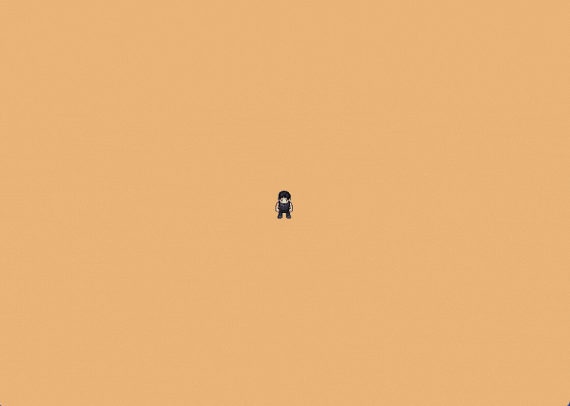

# 《急躁程序员的Bevy与Rust指南：第2章——让世界诞生》

通过本教程的学习,你将构建一个具有分层地形、水体和道具的程序化生成游戏世界。

**前提条件**: 这是我们的Bevy教程系列的第2章。[加入我们的社区](https://discord.com/invite/cD9qEsSjUH)以获取新发布的更新。在开始之前,请完成[第1章:让玩家诞生](/posts/bevy-rust-game-development-chapter-1/),或者从[这个仓库](https://github.com/jamesfebin/ImpatientProgrammerBevyRust)克隆第1章的代码以跟随学习。



**在我们开始之前:** 我一直在努力改进这个教程,让你的学习旅程更加愉快。你的反馈很重要——在[Reddit](https://www.reddit.com/r/bevy/comments/1o3y2hr/the_impatient_programmers_guide_to_bevy_and_rust/)/[Discord](https://discord.com/invite/cD9qEsSjUH)/[LinkedIn](https://www.linkedin.com/posts/febinjohnjames_chapter-2-let-there-be-a-world-continuing-activity-7382797407824039936-WXFD?utm_source=share&utm_medium=member_desktop&rcm=ACoAAAlx1JIBRLKRFr1OsUTf1LYBNPYbgdfxjbc)上分享你的挫折、问题或建议。喜欢它吗?让我知道什么对你有效!让我们一起让用Rust和Bevy进行游戏开发对每个人都更加容易。

## 程序化生成

我尊重手工制作瓦片来构建游戏世界的艺术家。但我属于急躁/懒惰的物种。

我进行了一次探索,遇到了程序化生成。

我没想到涉及的复杂性。我几乎要放弃,但得益于上一章读者的评论和信息,我继续前进。三天前, enlightenment来了,所有部分都拼在了一起。

基本上,这就像拼图一样自动地将东西拼在一起。为了解决这个问题,让我们再次用系统的思维方式思考。

**程序化生成游戏世界需要什么?**
1. 瓦片集
2. 瓦片的插座,因为只有兼容的瓦片才能拟合
3. 兼容性规则
4. 使用这些组件生成连贯世界的魔法算法

**这个魔法算法如何工作?**

那个"魔法算法"有一个名字:波函数坍缩(WFC)。最简单的理解方式是通过一个微型数独。同样的想法:选择有效选项最少的单元格,放置一个值,更新邻居,并重复。如果选择导致死胡同,撤销那个猜测并尝试下一个选项。


**对于我们的基于瓦片的世界:** 想象每个网格单元格都是一个数独单元格,但我们放置的不再是数字,而是瓦片。

然后我们为有效连接制定规则:
- **规则1**: 水中心瓦片在所有边连接到其他水瓦片
- **规则2**: 水边缘瓦片有两种类型的边——面向水的边连接到其他水瓦片,面向陆地的边连接到岸边

算法使用这些规则确保瓦片正确地拟合在一起,创建具有自然外观岸线的连贯水体。

让我们看看它的实际应用:


**步骤1 - 初始网格**

我们从空网格开始,每个单元格都可能放置任何瓦片。`?`符号代表"叠加态"——每个单元格在算法开始约束之前都包含所有可能的瓦片。


**步骤2 - 第一次放置**

算法从放置初始水中心瓦片开始。遵循**规则1**,这个中心瓦片在所有边都需要其他水瓦片。这立即约束了相邻单元格——它们必须是能够连接到中心的水瓦片。


**步骤3 - 传播约束**

约束传播开始作用!算法通过放置更多的中心瓦片来扩展水域。顶部的边缘瓦片遵循**规则2**——它们的底部(面向水)连接到中心瓦片,而它们的顶部(面向陆地)将连接到岸边。


**步骤4 - 最终结果**

算法通过用适当的边界瓦片填充边缘来完成。注意我们的规则如何创建完美的连接——中心瓦片(**规则1**)在所有边都有水,而边缘和角落瓦片(**规则2**)的面向水的边向内连接,面向陆地的边连接到岸边,创建连贯的地理。

这演示了核心波函数坍缩算法的实际应用:
1. **找到最受限的单元格**——具有最少有效瓦片的单元格
2. **放置一个瓦片**,其插座与邻居兼容
3. **传播约束**——这个放置立即减少周围单元格的有效选项
4. **重复**直到网格完成

当我们遇到死胡同(单元格没有有效瓦片)时,我们的实现采用比数独更简单的方法:不是回溯之前的选择,而是使用新的随机种子(最多重试限制)重新开始整个过程,直到我们生成一个有效的地图。

**你说的"新的随机种子"是什么意思?**

"随机种子"是一个控制算法将遵循哪个"随机"序列的起始数字。相同的种子=每次都相同的世界顺序。当我们遇到死胡同时,不是回溯,而是生成一个新的随机种子并重新开始——这给了我们一个完全不同的瓦片选择序列来尝试。

**配置这种随机性有助于我们自定义地图吗?**

是的!算法的随机性来自于它选择单元格和瓦片的顺序,我们可以控制它来影响最终结果。通过调整随机种子或选择策略,我们可以:
- **偏向某些模式**——给某些瓦片更高的权重以创建特定的景观类型
- **控制大小和复杂性**——影响我们是得到小池塘还是大湖泊
- **创建可预测的变化**——使用相同的种子以获得一致的结果,或使用不同的种子以获得多样性

同一个瓦片集可以通过调整随机性概率配置来生成连贯景观的无数变化,从简单的池塘到复杂的分支河流系统。

> 虽然波函数坍缩很强大,但它有其局限性。
> - **没有大规模结构控制**——WFC专注于瓦片兼容性,因此它不会自动创建"一个大湖"或"山脉范围"这样的大模式
> - **可能会卡住**——复杂的规则可能导致不可能的情况,其中没有有效的瓦片,需要重新开始
> - **性能取决于复杂性**——更多的瓦片类型和更严格的规则增加计算时间和失败率
> - **需要仔细的规则设计**——设计不当的兼容性规则可能导致不切实际或破损的景观

我们将在后面的章节中解决这些局限性。现在,我们将专注于构建我们游戏世界的功能部分,这将成为构建更大游戏世界的基础。

## 从理论到实现

现在我们理解了波函数坍缩**如何**工作——约束传播、插座兼容性和瓦片放置逻辑。是时候将这些知识转化为实际运行的代码了。

**实现的现实:**

从头构建WFC算法很复杂。你需要实现:
- 整个网格的约束传播
- 遇到死胡同时回溯
- 跟踪可能性的高效数据结构
- 网格坐标管理
- 具有适当概率权重的随机选择

在我们甚至到达游戏特定部分之前,比如精灵、规则和世界设计,这是大量的算法复杂性。

**我们的方法:**

不是重新发明轮子,我们将使用处理WFC算法内部机制的库。这让我们专注于使我们的游戏独一无二的部分:瓦片、规则、世界美学。我们定义**我们想要什么**;库计算出**如何实现它**。

## 设置我们的工具包

让我们将程序化生成库添加到我们的项目中。我们将使用[`bevy_procedural_tilemaps`](https://crates.io/crates/bevy_procedural_tilemaps) crate,这是通过分叉[`ghx_proc_gen`](https://crates.io/crates/ghx_proc_gen)库创建的。我创建这个分叉主要是为了确保与最新Bevy的兼容性,并简化本教程。

如果你需要高级功能,请查看Guillaume Henaux的原始[`ghx_proc_gen`](https://crates.io/crates/ghx_proc_gen) crate,它包括3D功能和调试工具。

希望你在跟随第1章的代码。这是[源代码](https://github.com/jamesfebin/ImpatientProgrammerBevyRust)。

更新你的`Cargo.toml`,加入bevy_procedural_tilemaps crate:

```toml
[package]
name = "bevy_game"
version = "0.1.0"
edition = "2024"

[dependencies]
bevy = "0.18"
bevy_procedural_tilemaps = "0.2.0"
```

## Bevy程序化瓦片地图

`bevy_procedural_tilemaps`库处理生成基于规则的连贯世界的复杂逻辑。

**库处理的内容**

库处理程序化生成的**算法复杂性**:
- **规则处理**:将我们的游戏规则转换为库的内部格式
- **生成器创建**:使用我们的配置构建程序化生成引擎
- **约束求解**:根据规则确定哪些瓦片可以放在哪里
- **网格管理**:处理2D网格系统和坐标转换
- **实体生成**:创建Bevy实体并正确定位它们

**我们需要提供的内容**

我们需要给库提供游戏所需的**特定信息**:
- **精灵定义**:每种瓦片类型使用哪些精灵
- **兼容性规则**:哪些瓦片可以彼此相邻放置
- **生成配置**:我们特定游戏世界的模式和约束
- **资源数据**:精灵信息、定位和自定义组件


既然我们理解了程序化生成系统如何工作,让我们构建我们的地图模块。

> **重要提示** 
> 与第1章不同,你在那里可以立即看到结果,程序化生成需要做一些基础工作。在看到生成的世界之前,你需要创建资源加载器、瓦片生成基础设施。
> 
> 当你完成草地层时,回报就来了。在那时,你已经学会了完整的模式。添加水和道具变得简单,只需使用不同的精灵和连接规则重复。在此过程中,你将理解Rust概念(生命周期、trait边界、闭包),这些概念适用于任何Rust项目。
> 
> 如果概念在第一次阅读时感觉不清楚,不要放弃。这在程序化生成中是正常的。重读令人困惑的部分,尝试代码,理解就会浮现。精通来自于摆弄,而不是第一次通过时的完美理解。

## 地图模块

我们将在`src`文件夹内创建一个专门的`map`文件夹来容纳我们所有的世界生成逻辑。

**为什么要为地图生成创建单独的文件夹?**

地图系统需要多个组件协同工作。世界生成涉及:
- **资源管理**——加载和组织数百个瓦片图像
- **规则定义**——不同地形类型之间的兼容性规则
- **网格设置**——配置地图尺寸和坐标系统

试图将所有这些逻辑放入一个文件会创建一个大文件,可能变得难以导航。

```
src/
├── main.rs
├── player.rs
└── map/
    ├── mod.rs       
    ├── assets.rs       
```

**`mod.rs`是什么?**

`mod.rs`文件是Rust声明文件夹中存在哪些模块的方式。它就像我们地图模块的"目录"。将以下行添加到你的`mod.rs`:

```rust
// src/map/mod.rs
pub mod assets;   // 将assets.rs暴露为模块
```

**为什么特别是`mod.rs`?**

这是Rust约定,当你创建一个文件夹时,Rust会查找`mod.rs`来理解模块结构。

### 创建SpawnableAsset

让我们在`map`文件夹内创建我们的`assets.rs`文件。这将定义我们如何在世界中生成精灵的基础。

`bevy_procedural_tilemaps`库需要知道在每个生成的位置**实际放置什么**。

它需要以下详细信息:
1. 从我们的瓦片地图图集中使用哪个精灵?
2. 将其精确定位在哪里?
3. 添加哪些组件(碰撞、物理等)?

库期望我们以非常特定的格式提供此信息。为你的游戏中的每个瓦片类型这样做——草地、泥土、树木、岩石、水等——会导致冗余代码。

这就是`SpawnableAsset`的作用所在。它是我们的**抽象层**,帮助你避免不必要的样板代码。

```rust
// src/map/assets.rs

use bevy::{prelude::*, sprite::Anchor};
use bevy_procedural_tilemaps::prelude::*;

#[derive(Clone)]
pub struct SpawnableAsset {
    /// 瓦片地图集内精灵的名称
    sprite_name: &'static str,
    /// 网格坐标中的偏移量(用于多瓦片对象)
    grid_offset: GridDelta,
    /// 世界坐标中的偏移量(精确定位)
    offset: Vec3,
    /// 用于添加自定义组件的函数(如碰撞、物理等)
    components_spawner: fn(&mut EntityCommands),
}
```

**SpawnableAsset结构体**

`SpawnableAsset`结构体包含在我们世界中生成瓦片所需的所有信息。`sprite_name`字段给你的精灵一个名称(如"grass"、"tree"、"rock")。

`grid_offset`用于跨越多个瓦片的对象——这是在瓦片网格本身内的定位。

例如,以下树木资产需要四个瓦片。


**网格偏移**

| 树木部分 | 网格偏移 | 描述 |
|-----------|---------|------|
| 左下 | `(0, 0)` | 停留在原位置 |
| 右下 | `(1, 0)` | 向右移动一个瓦片 |
| 左上 | `(0, 1)` | 向上移动一个瓦片 |
| 右上 | `(1, 1)` | 向上并向右移动一个瓦片 |

另一方面,`offset`字段用于微调瓦片内的位置——比如将岩石稍微向左移动,或确保树干完美地居中在其瓦片空间内。

让我们看看`offset`如何与岩石定位一起工作:


**偏移**

| 岩石 | 偏移 | 描述 |
|-----|------|------|
| 岩石1 | `(0, 0)` | 在瓦片中居中 |
| 岩石2 | `(-8, -6)` | 稍微向左和向上移动 |
| 岩石3 | `(6, 5)` | 稍微向右和向下移动 |

最后,`components_spawner`是一个添加自定义行为的函数,如碰撞、物理或其他游戏机制。

**为什么精灵名称定义为`&'static str`?**

让我们逐段分解`&'static str`来理解我们为什么将其用于精灵名称。

`&`符号意味着"引用到"——不是制作文本的新副本,我们只是记录原始文本的位置。

`'static`是一个特殊的生命周期注释,告诉Rust"这个文本将在你的整个游戏期间存在"。当你在代码中直接写`"grass"`时,Rust会在你构建时将其烘焙到你的游戏文件中。它总是在那里,从游戏启动到关闭。

**什么是生命周期,`'static`有什么关系?**

**生命周期**是Rust跟踪数据在内存中存在多长时间的方式。Rust需要知道何时安全地使用数据以及何时可能被删除。

大多数数据都有有限的生命周期。例如:
- 局部变量仅在函数运行时存在
- 函数参数仅在函数执行时存在
- 在循环中创建的数据可能在循环结束时被删除

但有些数据永远存在——比如嵌入在程序中的字符串字面量。`'static`生命周期意味着"这个数据将在程序的整个持续时间内存在"——它永远不会被删除。

这对于我们的精灵名称来说非常完美,因为它们硬编码在我们的源代码中(如`"grass"`, `"tree"`, `"rock"`),并且在程序运行期间永远不会改变或被删除。Rust可以安全地让我们在代码中的任何地方使用这些引用,因为它知道数据将始终在那里。

**什么是字符串字面量?**

字符串字面量是你直接在代码中用引号写的文本:`"grass"`, `"dirt"`, `"tree"`。

**为什么Rust需要知道何时安全地使用数据?其他语言似乎不关心这个。**

大多数语言(如C、C++、Java、Python)以不同的方式处理内存安全:
- **C/C++**: 根本不跟踪生命周期——你可能会意外使用已删除的数据,导致崩溃或安全漏洞
- **Java/Python/C#**: 使用垃圾回收——运行时自动删除未使用的数据,但这增加了开销和不可预测的暂停
- **Rust**: 在编译时跟踪生命周期——在没有运行时开销的情况下防止崩溃

`&'static str`意味着"一个引用(`&`),到一个字符串切片(`str`),该切片在整个程序持续时间内存在(`'static`)"。这给了我们所有世界中最好的东西:内存效率(没有复制)、性能(直接访问)和安全(Rust知道数据将始终有效)。


**`GridDelta`是什么?**

`GridDelta`是一个表示网格坐标中移动的结构体。它指定"向每个方向移动多少个瓦片"。例如,`GridDelta::new(1, 0, 0)`意味着"向右移动一个瓦片",而`GridDelta::new(0, 1, 0)`意味着"向上移动一个瓦片"。它用于定位前面提到的具有多个瓦片的树精灵等多瓦片对象。

**为什么`components_spawner`定义为`fn(&mut EntityCommands)`?**

这是一个接受`EntityCommands`可变引用(Bevy向实体添加组件的方式)的函数指针。查看`assets.rs`中的代码,我们可以看到它默认为一个什么都不做的空函数。

函数指针允许我们自定义添加到每个生成实体的组件。例如,树精灵可能需要碰撞组件以进行物理,而装饰性花朵可能只需要基本的渲染组件。每个精灵都可以有自己的自定义组件集,而不影响其他。

**为什么我们需要EntityCommands的可变引用?**

是的!在Rust中,当你想要修改某些东西时,你需要一个可变引用(`&mut`)。`EntityCommands`需要是可变的,因为它用于添加、删除或修改实体上的组件。

现在让我们向我们的`SpawnableAsset`结构体添加一些有用的方法,以使创建和配置精灵资产变得更容易。

将以下代码附加到同一个`assets.rs`文件:

```rust
// src/map/assets.rs
impl SpawnableAsset {
    pub fn new(sprite_name: &'static str) -> Self {
        Self {
            sprite_name,
            grid_offset: GridDelta::new(0, 0, 0),
            offset: Vec3::ZERO,
            components_spawner: |_| {}, // 默认:没有额外的组件
        }
    }

    pub fn with_grid_offset(mut self, offset: GridDelta) -> Self {
        self.grid_offset = offset;
        self
    }
}
```

**`-> Self`是什么?**

在Rust中,你必须指定函数的返回类型(不像某些可以推断它的语言)。`-> Self`确切地告诉编译器函数返回什么类型,这有助于在编译时捕获错误。`Self`意味着"与这个方法所属的结构体相同的类型"——所以这里`Self`指的是`SpawnableAsset`。

**`|_| {}`是什么?**

这是一个什么都不做的闭包(匿名函数)。`|_|`意味着"接受一个参数但忽略它"(下划线意味着我们不使用该参数),而`{}`是一个空的函数体。

我们需要这个,因为我们的`SpawnableAsset`结构体需要一个`components_spawner`字段(正如我们在结构体定义中所看到的),但对于基本精灵,我们不想添加任何自定义组件。这个空闭包作为一个"什么都不做"的默认值。我们将在后面的章节中学习如何使用这个字段来添加自定义组件,但现在它只是一个满足结构体要求的占位符。

**什么是闭包?你说的匿名函数是什么意思?**

闭包是一个可以"捕获"其周围环境变量的函数。匿名函数意味着它没有名称——你在需要它的地方内联定义它,而不是像`fn my_function()`那样单独声明。

**为什么在这里使用闭包?**

在我们的SpawnableAsset结构体中,闭包允许每个精灵在生成时具有自定义行为。例如,树可能需要碰撞组件,而装饰性花朵可能需要不同的组件。闭包可以捕获游戏状态和配置来为每个精灵类型自定义生成行为。

**为什么这些函数的最后一行缺少分号?**

在Rust中,函数的最后一个表达式自动返回,而不需要`return`关键字或分号。这使指定应该返回什么值更容易——你只是写你想要返回的表达式,Rust处理其余部分。这是Rust使代码更清晰、更简洁的方式。

**为什么不能直接操作或检索`grid_offset`?**

`GridDelta`的字段是私有的(它们没有`pub`关键字),这意味着只能从定义`GridDelta`的模块内访问它们。这被称为"封装"——它防止开发者通过直接修改结构体的数据来犯错,这可能会破坏内部逻辑。我们提供公共方法`with_grid_offset()`来安全地修改它,同时保持结构体的完整性。

既然我们理解了如何用`SpawnableAsset`定义我们的精灵,**我们如何在我们的游戏中加载和使用这些精灵?**

### 加载精灵资产

我们的游戏使用**精灵图集**——一张包含我们所有精灵的大型图像。Bevy需要知道每个精灵在这个图像中的位置,我们需要避免多次重新加载同一图像。

在`src/assets`文件夹中创建一个`tile_layers`文件夹,并将`tilemap.png`放在里面,你可以从这个[github仓库](https://github.com/jamesfebin/ImpatientProgrammerBevyRust)获取它。


*本示例中使用的瓦片地图资产基于George Bailey在OpenGameArt上以CC-BY 4.0许可证提供的[16x16游戏资产](https://opengameart.org/content/16x16-game-assets)。但是,要遵循本教程,请使用本章[github仓库](https://github.com/jamesfebin/ImpatientProgrammerBevyRust)提供的tilemap.png。*

现在在`src/map`文件夹内创建一个文件`tilemap.rs`。当你在map文件夹内添加文件时,确保通过添加行`pub mod tilemap`在`mod.rs`中注册它。

这是我们的瓦片地图定义发挥作用的地方——它作为一个"地图",告诉Bevy我们图集中每个精灵的坐标。

```rust
// src/map/tilemap.rs
use bevy::math::{URect, UVec2};

pub struct TilemapSprite {
    pub name: &'static str,
    pub pixel_x: u32,
    pub pixel_y: u32,
}

pub struct TilemapDefinition {
    pub tile_width: u32,
    pub tile_height: u32,
    pub atlas_width: u32,
    pub atlas_height: u32,
    pub sprites: &'static [TilemapSprite],
}
```

`TilemapSprite`结构体代表我们图集中的单个精灵。它存储精灵的名称(如"dirt"或"green_grass")及其在图集中的确切像素坐标。

`TilemapDefinition`结构体作为Bevy用来理解如何将我们的图集图像分割成单个精灵的"蓝图"。

1. **`tile_width`和`tile_height`**——每个单个精灵的大小(在我们的情况下,32×32像素)
2. **`atlas_width`和`atlas_height`**——你的整个精灵图集图像的总大小(包含所有精灵的大图像)
3. **`sprites`**——你图集中所有精灵的列表,每个都有其名称和位置

尽管我们的瓦片地图存储精灵名称和像素坐标,但Bevy的纹理图集系统需要数字索引和矩形区域。这些方法执行必要的转换。

将以下代码附加到你的`tilemap.rs`:

```rust
// src/map/tilemap.rs

impl TilemapDefinition {
    pub const fn tile_size(&self) -> UVec2 {
        UVec2::new(self.tile_width, self.tile_height)
    }

    pub const fn atlas_size(&self) -> UVec2 {
        UVec2::new(self.atlas_width, self.atlas_height)
    }

    pub fn sprite_index(&self, name: &str) -> Option<usize> {
        self.sprites.iter().position(|sprite| sprite.name == name)
    }

    pub fn sprite_rect(&self, index: usize) -> URect {
        let sprite = &self.sprites[index];
        let min = UVec2::new(sprite.pixel_x, sprite.pixel_y);
        URect::from_corners(min, min + self.tile_size())
    }
}
```

`tile_size()`方法将我们的瓦片尺寸转换为Bevy用于尺寸计算的`UVec2`(无符号2D向量)。同样,`atlas_size()`将整个图集尺寸作为`UVec2`提供,Bevy用它来创建纹理图集布局。

`sprite_index()`方法有助于按名称查找精灵。当我们想要渲染"dirt"瓦片时,此方法搜索我们的精灵数组并返回该精灵的索引位置。

最后,`sprite_rect()`获取一个精灵索引并计算包含该精灵在我们图中的确切矩形区域。它使用`URect`(无符号矩形)来定义边界,这是Bevy的纹理图集系统需要的,以知道要显示大图像的哪个部分。

现在让我们通过添加我们的第一个精灵——泥土瓦片——来使用我们的瓦片地图定义。

### 添加泥土瓦片

让我们从一个简单的泥土瓦片开始来测试我们的瓦片地图系统。泥土瓦片位于我们256x320图集图像的像素坐标(128, 0)处。我们稍后会添加更多瓦片来构建我们的游戏世界。

将此代码附加到`tilemap.rs`:

```rust
// src/map/tilemap.rs
pub const TILEMAP: TilemapDefinition = TilemapDefinition {
    tile_width: 32,
    tile_height: 32,
    atlas_width: 256,
    atlas_height: 320,
    sprites: &[
          TilemapSprite {
            name: "dirt",
            pixel_x: 128,
            pixel_y: 0,
        },
    ]
};
```

注意我们如何使用const定义——这意味着所有这些精灵元数据都在编译时确定。

### 将瓦片地图连接到资源加载

现在我们已经在`tilemap.rs`中定义了我们的瓦片地图和精灵,我们需要将其连接到`assets.rs`中的资源加载系统。

让我们更新`assets.rs`中的导入以引入我们的`TILEMAP`定义:

```rust
// src/map/assets.rs
use bevy::prelude::*; 
use bevy_procedural_tilemaps::prelude::*;
use crate::map::tilemap::TILEMAP; // <--- 行更新提醒
```

有了导入,我们现在可以构建帮助我们的程序化渲染系统的三个关键函数:
1. `TilemapHandles`——容纳我们加载的图集和布局数据的容器
2. `prepare_tilemap_handles`——从磁盘加载图集图像并创建定义每个精灵矩形区域的纹理图集布局
3. `load_assets`——将精灵名称转换为准备好渲染的`Sprite`数据结构

让我们逐步构建这些。

### 创建TilemapHandles结构体

首先,我们需要一种方法来同时保存对图集图像及其布局的引用。继续并将此代码附加到你的`assets.rs`中:

```rust
// src/map/assets.rs
#[derive(Clone)]
pub struct TilemapHandles {
    pub image: Handle<Image>,
    pub layout: Handle<TextureAtlasLayout>,
}

impl TilemapHandles {
    pub fn sprite(&self, atlas_index: usize) -> Sprite {
        Sprite::from_atlas_image(
            self.image.clone(),
            TextureAtlas::from(self.layout.clone()).with_index(atlas_index),
        )
    }
}
```

`TilemapHandles`结构体是两个句柄的容器:`image`指向我们加载的精灵图文件,而`layout`指向告诉Bevy如何将该图像分割成单个精灵的图集布局。

`sprite(atlas_index)`方法是一个便捷函数,它通过将图像和布局与特定索引结合起来,创建一个准备好渲染的`Sprite`。例如,如果泥土瓦片位于索引0,调用`tilemap_handles.sprite(0)`给我们一个配置为仅从我们的图集显示泥土瓦片的`Sprite`。

### 从磁盘加载图集

现在让我们创建实际加载图集图像文件并设置布局的函数。我们将使用前面提到的`TILEMAP`定义。

```rust
// src/map/assets.rs
pub fn prepare_tilemap_handles(
    asset_server: &Res<AssetServer>,
    atlas_layouts: &mut ResMut<Assets<TextureAtlasLayout>>,
    assets_directory: &str,
    tilemap_file: &str,
) -> TilemapHandles {
    let image = asset_server.load::<Image>(format!("{}/{}", assets_directory, tilemap_file));
    let mut layout = TextureAtlasLayout::new_empty(TILEMAP.atlas_size());
    for index in 0..TILEMAP.sprites.len() {
        layout.add_texture(TILEMAP.sprite_rect(index));
    }
    let layout = atlas_layouts.add(layout);

    TilemapHandles { image, layout }
}
```

**分解:**

1. **加载图像**: `asset_server.load()`从磁盘请求图集图像文件
2. **创建空布局**: `TextureAtlasLayout::new_empty(TILEMAP.atlas_size())`创建一个匹配我们256x320图集的布局
3. **注册每个精灵**: 循环遍历`TILEMAP`中的所有精灵,使用`TILEMAP.sprite_rect(index)`获取每个精灵的坐标并将它们添加到布局
4. **存储并返回**: 布局被添加到Bevy的资产系统,我们返回一个包含两个句柄的`TilemapHandles`

这就是`TILEMAP.atlas_size()`和`TILEMAP.sprite_rect()`从我们的瓦片地图定义中发挥作用的地方——它们确切地告诉Bevy如何切割我们的图集图像!

> 此函数将图集加载到内存并设置布局结构,但实际上还没有生成游戏世界。我们只是在准备程序化生成器稍后将使用的工具。

### 将精灵名称转换为可渲染的精灵

最后,我们需要一种将精灵名称(如"dirt")转换为可以渲染的`Sprite`对象的方法。

```rust
// src/map/assets.rs
pub fn load_assets(
    tilemap_handles: &TilemapHandles,
    assets_definitions: Vec<Vec<SpawnableAsset>>,
) -> ModelsAssets<Sprite> {
    let mut models_assets = ModelsAssets::<Sprite>::new();
    for (model_index, assets) in assets_definitions.into_iter().enumerate() {
        for asset_def in assets {
            let SpawnableAsset {
                sprite_name,
                grid_offset,
                offset,
                components_spawner,
            } = asset_def;

            let Some(atlas_index) = TILEMAP.sprite_index(sprite_name) else {
                panic!("Unknown atlas sprite '{}'", sprite_name);
            };

            models_assets.add(
                model_index,
                ModelAsset {
                    assets_bundle: tilemap_handles.sprite(atlas_index),
                    grid_offset,
                    world_offset: offset,
                    spawn_commands: components_spawner,
                },
            )
        }
    }
    models_assets
}
```

**为什么是两个循环?**

有些瓦片很简单,只需要一个精灵(比如泥土)。其他的很复杂,需要多个精灵(比如需要4个部分的树)。

外循环说"对于每种类型的瓦片",内循环说"对于该瓦片需要的每个精灵"。

**当我们加载泥土瓦片时会发生什么?**

1. 我们有: `SpawnableAsset { sprite_name: "dirt", ... }`
2. 函数询问TILEMAP: "'dirt'在哪里?" → TILEMAP回复: "索引0"
3. 然后它询问TilemapHandles: "给我索引0的精灵" → 获得一个`Sprite`对象
4. 最后,它将所有东西连同定位信息打包在一起并存储

**最终数据看起来像什么?**

`load_assets`完成后,我们在内存中有一个`ModelAsset`对象集合。以下是几个瓦片的数据结构:

| 模型 | 字段 | 值 | 意思 |
|------|------|-----|------|
| **泥土** | `assets_bundle` | `Sprite(atlas_index: 0)` | 指向图集中的泥土精灵 |
| | `grid_offset` | `(0, 0, 0)` | 不需要网格偏移 |
| | `world_offset` | `(0, 0, 0)` | 不需要世界偏移 |
| **树(底部)** | `assets_bundle` | `Sprite(atlas_index: 31)` | 指向树底部精灵 |
| | `grid_offset` | `(0, 0, 0)` | 放置在基础位置 |
| | `world_offset` | `(0, 0, 0)` | 居中 |
| **树(顶部)** | `assets_bundle` | `Sprite(atlas_index: 30)` | 指向树顶部精灵 |
| | `grid_offset` | `(0, 1, 0)` | 从底部向上一个瓦片 |
| | `world_offset` | `(0, 0, 0)` | 居中 |

**重要:** 这些只是内存中的数据结构——还没有在屏幕上绘制任何东西! 实际渲染发生在程序化生成器使用这些准备好的`ModelAsset`对象生成实体时。

> **巨大进步!** 你已经通过了基础层——精灵、瓦片地图和资源加载。现在我们有了视觉部分(资产),但生成器如何知道哪些瓦片可以彼此相邻放置?这就是模型和插座发挥作用的地方!

## 从瓦片到模型

你已经理解了**瓦片**——单个视觉部分,如草地、泥土和水。现在我们需要通过向这些瓦片添加插座并定义连接规则来构建模型,以便生成器可以找出有效的放置。

### 模型如何暴露插座

模型在每条边上暴露**插座**——标记的连接点。让我们看看一个绿色草地模型,并看看它如何在不同的方向上暴露插座。

**水平平面(x和y方向)**


- **向上** → grass.material
- **向左** → grass.material  
- **向右** → grass.material
- **向下** → grass.material

**垂直轴(z方向)**


- **向上(z_pos)** → grass.layer_up
- **向下(z_neg)** → grass.layer_down

**z轴在2D游戏中如何说得通?**

尽管我们正在构建2D游戏,但z轴代表**分层**——想象将透明片相互堆叠。以下是如何与我们的黄色草地示例一起工作的:

**分层系统:**
- **泥土瓦片**形成基础层(地面层)
- **绿色草地瓦片**可以位于泥土之上(向上一层)
- **黄色草地瓦片**可以位于绿色草地之上(再向上一层)


### 构建模型

既然我们理解了模型如何在所有六个方向上暴露插座,我们需要一种创建这些模型并将它们链接到其视觉精灵的方法。

我们将使用一个名为`TerrainModelBuilder`的辅助工具,它在构建我们的世界时正确地保持模型和精灵配对。

### TerrainModelBuilder

在`map`文件夹内创建一个新文件`models.rs`,并且不要忘记将`pub mod models;`添加到你的`mod.rs`。

```rust
// src/map/models.rs
use bevy_procedural_tilemaps::prelude::*;
use crate::map::assets::SpawnableAsset;

/// 确保模型声明及其资源绑定保持对齐的实用包装器。
pub struct TerrainModelBuilder {
    pub models: ModelCollection<Cartesian3D>,
    pub assets: Vec<Vec<SpawnableAsset>>,
}
```

`TerrainModelBuilder`持有:
1. **`models`**——WFC算法使用的内容
2. **`assets`**——相应模型的精灵

现在让我们向构建器添加这些方法。

```rust
// src/map/models.rs
impl TerrainModelBuilder {
    pub fn new() -> Self {
        Self {
            models: ModelCollection::new(),
            assets: Vec::new(),
        }
    }

    pub fn create_model<T>(
        &mut self,
        template: T,
        assets: Vec<SpawnableAsset>,
    ) -> &mut Model<Cartesian3D>
    where
        T: Into<ModelTemplate<Cartesian3D>>,
    {
        let model_ref = self.models.create(template);
        self.assets.push(assets);
        model_ref
    }

    pub fn into_parts(self) -> (Vec<Vec<SpawnableAsset>>, ModelCollection<Cartesian3D>) {
        (self.assets, self.models)
    }
}
```

`new()`方法创建一个空构建器开始使用。

`create_model()`方法同时接受一个插座定义和相应的精灵,然后将它们添加到同一索引的各自集合中。

最后,`into_parts()`在你完成构建时将构建器分解回单独的集合,以便资产可以转到渲染器,模型可以转到WFC生成器。

**`pub fn create_model<T>`中的`<T>`在做什么?**

`<T>`是Rust的**泛型类型参数**——它是一个占位符,在你调用函数时会被实际类型填充。在我们的情况下,我们可能会传入不同类型的插座定义(简单的单插座瓦片或复杂的多插座瓦片),但我们想要对所有这些执行相同的操作。

泛型让我们编写一个可以处理多种类型的函数,只要它们都可以转换为`ModelTemplate`。这很强大,因为这意味着我们以后可以添加新的插座定义类型,而无需更改我们的`TerrainModelBuilder`代码。

**`where T: Into<ModelTemplate<Cartesian3D>>`是什么?**

这是一个**trait边界**,它告诉Rust泛型类型`T`必须具备什么能力。`where`子句说"T必须能够将自己转换为`ModelTemplate<Cartesian3D>`(3D模型模板)"。

`Into`是Rust说"这个类型知道如何将自己转换为那个类型"的方式——就像字符串可以转换为数字,或者我们的插座定义可以转换为模型模板。这意味着我们可以传入任何知道如何成为`ModelTemplate`的类型——无论是简单的单插座瓦片、复杂的多插座瓦片,甚至是你以后创建的自定义插座类型。

这给了我们灵活性,同时确保类型安全。编译器将捕获任何试图传入无法转换的类型的尝试,防止运行时错误!

### 构建基础

既然我们理解了如何保持模型和资产同步,让我们从底部开始构建我们的程序化世界。泥土层形成所有其他东西所在的基础。

**层让WFC更简单**

没有层,我们需要将所有规则塞进一个层:"水连接到水和草地","草地连接到草地和泥土","树木连接到草地","泥土连接到泥土"——加上所有的边缘情况和特殊连接。

这创建了一个巨大的相互依赖网络,使WFC算法难以找到有效的解决方案。

通过使用层,我们将这种复杂性分解为可管理的部分。每个层只需要担心它自己的连接,使WFC算法更有可能快速找到有效的解决方案。

让我们创建我们的泥土层,在`map`文件夹内创建一个新文件`sockets.rs`,并且不要忘记将`pub mod sockets;`添加到你的`mod.rs`。

```rust
// src/map/sockets.rs
use bevy_procedural_tilemaps::prelude::*;

pub struct TerrainSockets {
    pub dirt: DirtLayerSockets,
}

pub struct DirtLayerSockets {
    pub layer_up: Socket,      // 什么可以位于泥土之上
    pub layer_down: Socket,     // 泥土本身可以位于什么之上
    pub material: Socket,       // 泥土在水平方向连接什么
}
```

泥土层需要三种类型的插座。

1. **`layer_up`**——这个插座处理可以放置在泥土上方的层中。记住层是为了分离规则塞满的担忧(水可以位于草地上而不接触它)
2. **`layer_down`**——它处理泥土本身可以位于哪个层上。对于基础层,这将连接到void(空空间)
3. **`material`**——这处理泥土瓦片之间的水平连接,确保它们正确连接以形成连续的地面

**初始化插座**

现在我们实际上需要创建这些插座实例。将此函数附加到`sockets.rs`:

```rust
// src/map/sockets.rs
pub fn create_sockets(socket_collection: &mut SocketCollection) -> TerrainSockets {
    let mut new_socket = || -> Socket { socket_collection.create() };
    
    let sockets = TerrainSockets {
        dirt: DirtLayerSockets {
            layer_up: new_socket(),
            material: new_socket(),
            layer_down: new_socket(),
        },
    };
    sockets
}
```

`create_sockets`函数接受一个`SocketCollection`并创建我们所有的插座实例。`new_socket`闭包是一个辅助工具,调用`socket_collection.create()`来生成唯一的插座ID。每个插座都有一个唯一的标识符,WFC算法用它来跟踪兼容性规则。

### 构建泥土层

既然我们已经定义并初始化了我们的插座系统,我们需要创建告诉WFC算法如何使用这些插座的规则。这是我们要定义模型以及它们如何相互连接的地方。

在`map`文件夹内创建一个新文件`rules.rs`,并且不要忘记将`pub mod rules;`添加到你的`mod.rs`。

```rust
// src/map/rules.rs
use crate::map::assets::SpawnableAsset;
use crate::map::models::TerrainModelBuilder;
use crate::map::sockets::*;
use bevy_procedural_tilemaps::prelude::*;

fn build_dirt_layer(
    terrain_model_builder: &mut TerrainModelBuilder,
    terrain_sockets: &TerrainSockets,
    socket_collection: &mut SocketCollection,
) {
    terrain_model_builder
        .create_model(
            SocketsCartesian3D::Simple {
                x_pos: terrain_sockets.dirt.material, // 向右
                x_neg: terrain_sockets.dirt.material, // 向左
                z_pos: terrain_sockets.dirt.layer_up, // 向上
                z_neg: terrain_sockets.dirt.layer_down, // 向下
                y_pos: terrain_sockets.dirt.material, // 向上
                y_neg: terrain_sockets.dirt.material, // 向下
            },
            vec![SpawnableAsset::new("dirt")],
        )
        .with_weight(20.);

    socket_collection.add_connections(vec![
        (
            terrain_sockets.dirt.material,
            vec![terrain_sockets.dirt.material],
        ),
    ]);
}
```

**理解泥土层规则:**

1. **创建一个泥土模型**——定义一个在所有六条边**暴露**插座的瓦片
2. **暴露插座类型**——水平边暴露`dirt.material`,垂直边暴露层插座
3. **分配一个精灵**——`SpawnableAsset::new("dirt")`告诉渲染器使用哪个精灵
4. **设置权重**——`.with_weight(20.)`使泥土瓦片被放置的可能性提高20倍
5. **定义连接规则**——`add_connections`告诉WFC `dirt.material`可以连接到其他`dirt.material`

这创建了一个简单但有效的基础层,可以形成连续的地面,同时支持其他层在其之上!

现在让我们附加`build_world`函数,生成器将调用该函数以获取我们所有的泥土层规则和模型:

```rust
// src/map/rules.rs
pub fn build_world() -> (
    Vec<Vec<SpawnableAsset>>,
    ModelCollection<Cartesian3D>,
    SocketCollection,
) {
    let mut socket_collection = SocketCollection::new();
    let terrain_sockets = create_sockets(&mut socket_collection);

    let mut terrain_model_builder = TerrainModelBuilder::new();

    // 构建泥土层
    build_dirt_layer(
        &mut terrain_model_builder,
        &terrain_sockets,
        &mut socket_collection,
    );

    let (assets, models) = terrain_model_builder.into_parts();

    (assets, models, socket_collection)
}
```

**此函数的作用:**

1. **创建插座集合**——存储所有插座连接规则的地方
2. **获取我们的插座定义**——调用`create_sockets()`获取我们定义的所有插座类型
3. **创建模型构建器**——这保持我们的模型和资产同步
4. **构建泥土层**——调用我们的`build_dirt_layer`函数来创建所有泥土模型和规则
5. **返回三个集合**——用于渲染的资产,用于WFC规则的模型,以及用于连接的插座集合

这个函数是生成器调用以获取创建我们的程序化世界所需的所有规则和模型的函数!

### 生成泥土

现在我们拥有了所有组件——资产、模型、插座和规则——我们需要配置程序化生成引擎。

在`map`文件夹内创建一个新文件`generate.rs`,并且不要忘记将`pub mod generate;`添加到你的`mod.rs`。

```rust
// src/map/generate.rs
use bevy_procedural_tilemaps::prelude::*;
use bevy::prelude::*;

use crate::map::{
    assets::{load_assets, prepare_tilemap_handles},
    rules::build_world,
};

// -----------------  可配置的值 ---------------------------
/// 修改这些值以控制地图大小。
pub const GRID_X: u32 = 25;
pub const GRID_Y: u32 = 18;

// ------------------------------------------------------------------
const ASSETS_PATH: &str = "tile_layers";
const TILEMAP_FILE: &str = "tilemap.png";
/// 世界空间中一个块的大小(在Bevy 2d中,1像素是1世界单位)
pub const TILE_SIZE: f32 = 32.;
/// 网格节点在世界空间中的大小
const NODE_SIZE: Vec3 = Vec3::new(TILE_SIZE, TILE_SIZE, 1.);

const ASSETS_SCALE: Vec3 = Vec3::ONE;
/// 地图中的z层数,派生自默认地形层。
pub const GRID_Z: u32 = 1;

pub fn map_pixel_dimensions() -> Vec2 {
    Vec2::new(TILE_SIZE * GRID_X as f32, TILE_SIZE * GRID_Y as f32)
}
```

**理解配置常量:**

让我们分解每个常量控制的内容:

1. **`GRID_X`和`GRID_Y`**——这些定义了我们的生成世界在瓦片中的大小。25×18网格意味着总共450个瓦片(25 × 18 = 450)。你可以调整这些以创建更大或更小的世界,虽然更大的网格可能会导致WFC算法困难——我们将在后面的章节中解决扩展性问题
2. **`TILE_SIZE`**——这是每个瓦片在世界单位中的大小。由于我们使用32×32像素的精灵,每个瓦片占据32个世界单位。这影响你的世界在屏幕上看起来有多大
3. **`NODE_SIZE`**——这告诉生成器每个网格单元格在3D世界中占据多少空间。相等的值=完美的瓦片拟合,更小的NODE_SIZE=重叠的精灵,更大的NODE_SIZE=瓦片之间的间隙
4. **`GRID_Z`**——这定义了我们的世界有多少层。我们目前使用1层作为泥土,但稍后会添加更多层以将不同的地形类型堆叠在一起(泥土、草地、黄色草地、水、道具)
5. **`ASSETS_SCALE`**——这控制精灵的大小乘数器。`Vec3::ONE`意味着精灵以其原始大小渲染

现在让我们附加`setup_generator`函数,该函数设置我们的程序化生成引擎:

```rust
// src/map/generate.rs
pub fn setup_generator(
    mut commands: Commands,
    asset_server: Res<AssetServer>,
    mut atlas_layouts: ResMut<Assets<TextureAtlasLayout>>,
) {
    // 1. 规则初始化——获取瓦片定义和连接规则
    let (assets_definitions, models, socket_collection) = build_world();

    let rules = RulesBuilder::new_cartesian_3d(models, socket_collection)
        // 使用ZForward作为向上轴(模型的旋转轴),因为我们在2D中使用Bevy
        .with_rotation_axis(Direction::ZForward)
        .build()
        .unwrap();

    // 2. 网格——创建具有换行行为(false, false, false)的3D世界空间
    let grid = CartesianGrid::new_cartesian_3d(GRID_X, GRID_Y, GRID_Z, false, false, false);

    // 3. 配置算法——设置WFC行为
    let gen_builder = GeneratorBuilder::new()
        .with_rules(rules)
        .with_grid(grid.clone())
        .with_rng(RngMode::RandomSeed)
        .with_node_heuristic(NodeSelectionHeuristic::MinimumRemainingValue)
        .with_model_heuristic(ModelSelectionHeuristic::WeightedProbability);
    
    let generator = gen_builder.build().unwrap();

    // 4. 加载资产——加载精灵图集并转换为可渲染的资产
    let tilemap_handles =
        prepare_tilemap_handles(&asset_server, &mut atlas_layouts, ASSETS_PATH, TILEMAP_FILE);
    let models_assets = load_assets(&tilemap_handles, assets_definitions);

    // 5. 生成生成器——创建具有Transform和NodesSpawner的实体
    commands.spawn((
        Transform::from_translation(Vec3 {
            x: -TILE_SIZE * grid.size_x() as f32 / 2.,
            y: -TILE_SIZE * grid.size_y() as f32 / 2.,
            z: 0.,
        }),
        grid,
        generator,
        NodesSpawner::new(models_assets, NODE_SIZE, ASSETS_SCALE).with_z_offset_from_y(true),
    ));
}
```

**规则初始化**

这创建了WFC算法使用的**约束求解器**。它获取我们的瓦片定义和连接规则,并将它们转换为算法可以理解的格式。

**为什么是`Direction::ZForward`?**

由于我们正在构建2D游戏,我们需要告诉系统使用哪个轴进行旋转。`Direction::ZForward`意味着瓦片围绕Z轴旋转(指向/背离屏幕的方向),这对于2D俯视视角来说是有意义的。

**网格**

这创建了我们的瓦片将被放置的世界空间。三个布尔参数控制换行行为:
1. **`(false, false, false)`**——大多数游戏,如Minecraft、Terraria(硬边界)
2. **`(true, true, false)`**——经典的小行星或吃豆人(左右和上下都环绕)
3. **`(true, true, true)`**——具有无限感觉的3D世界的高级模拟

**配置算法**

这是我们配置WFC算法行为的地方:
1. `RngMode::RandomSeed`——使用随机种子(相同的种子=每次都相同的世界)
2. `NodeSelectionHeuristic::MinimumRemainingValue`——始终选择最受限的单元格(有效瓦片最少)
3. `ModelSelectionHeuristic::WeightedProbability`——根据它们的权重选择瓦片(更高的权重=更有可能)

**加载资产和生成生成器**

`prepare_tilemap_handles()`从磁盘加载我们的精灵图集,而`load_assets()`将我们的精灵定义转换为可渲染的资产。

`commands.spawn()`创建一个具有`Transform`的生成器实体,该变换将世界居中在屏幕上,以及一个处理实际瓦片创建的`NodesSpawner`。

`with_z_offset_from_y(true)`设置使用Y坐标进行Z层定位——在屏幕上方的瓦片在前面渲染,创建自然的深度排序(例如,位于Y=10的树出现在位于Y=5的岩石前面)。

#### 最终模块结构

在本章中,我们一直在跨多个文件构建我们的程序化生成系统。在我们将其集成到你的主游戏之前,确保你的`src/map/mod.rs`文件包含我们创建的所有模块:

```rust
// src/map/mod.rs
pub mod generate;
pub mod assets;
pub mod models;
pub mod rules;
pub mod sockets;
pub mod tilemap;
```

确保你的`mod.rs`文件匹配此结构,然后再继续到集成步骤。

#### 将生成器集成到你的游戏中

现在我们已经构建了我们的程序化生成系统,我们需要将其集成到我们的主游戏中。我们将更新`main.rs`文件以包含程序化生成插件,并设置窗口大小以匹配我们生成的世界。

**更新main.rs**

我们需要添加程序化生成插件并配置窗口大小以匹配我们生成的世界。更新你的`main.rs`:

```rust
// src/main.rs
mod map;
mod player;

use bevy::{
    prelude::*,
    window::{Window, WindowPlugin, WindowResolution},
};

use bevy_procedural_tilemaps::prelude::*;

use crate::map::generate::{map_pixel_dimensions, setup_generator};
use crate::player::PlayerPlugin;

fn main() {
    let map_size = map_pixel_dimensions();

    App::new()
        .insert_resource(ClearColor(Color::WHITE))
        .add_plugins(
            DefaultPlugins
                .set(AssetPlugin {
                    file_path: "src/assets".into(),
                    ..default()
                })
                .set(WindowPlugin {
                    primary_window: Some(Window {
                        resolution: WindowResolution::new(map_size.x as u32, map_size.y as u32),
                        resizable: false,
                        ..default()
                    }),
                    ..default()
                })
                .set(ImagePlugin::default_nearest()),
        )
        .add_plugins(ProcGenSimplePlugin::<Cartesian3D, Sprite>::default())
        .add_systems(Startup, (setup_camera, setup_generator))
        .add_plugins(PlayerPlugin)
        .run();
}

fn setup_camera(mut commands: Commands) {
    commands.spawn(Camera2d);
}
```

**新增内容:**

1. **地图模块导入**——`mod map;`引入我们的程序化生成代码
2. **窗口大小**——`map_pixel_dimensions()`根据我们的网格尺寸计算窗口大小
3. **程序化生成插件**——`ProcGenSimplePlugin`处理WFC算法执行
4. **生成器设置**——`setup_generator`在启动时运行以创建我们的世界
5. **图像过滤**——`ImagePlugin::default_nearest()`保持像素艺术清晰

**运行你的程序化世界**

现在运行你的游戏:

```bash
cargo run
```

你应该看到一个程序化生成的世界,其中泥土瓦片遵循我们定义的规则!世界将居中在屏幕上,窗口大小将匹配你的网格尺寸(25×18瓦片=800×576像素)。


**玩家在哪里?**

玩家实际上在那里,但它在泥土瓦片后面渲染。

我们需要让玩家渲染在我们拥有的其他层的顶部。

**添加Z位置常量**

```rust
// src/player.rs,请将其放在ANIM_DT常量下面
const PLAYER_Z: f32 = 20.0; 
```

**更新** spawn函数**以使用此Z值并稍微缩小玩家(以便与我们的生成世界获得更好的视觉比例)。

```rust
// src/player.rs - 更新spawn_player中的Transform行
Transform::from_translation(Vec3::new(0., 0., PLAYER_Z)).with_scale(Vec3::splat(0.8)),
```

再次运行:

```bash
cargo run
```

你的玩家在所有瓦片的前面渲染,并且与32×32瓦片世界成比例!


## 添加草地层

现在我们有工作的泥土基础,让我们在它上面添加草地。草地层将创建位于泥土上的绿色草地斑块,并具有平滑过渡的适当边缘瓦片。

### 步骤1:将草地精灵添加到瓦片地图

首先,我们需要将所有草地精灵坐标添加到我们的瓦片地图。将这些精灵附加到`tilemap.rs`中的`sprites`数组:

```rust
// src/map/tilemap.rs - 在TilemapDefinition结构体内的dirt精灵之后将这些添加到sprites数组
TilemapSprite {
    name: "green_grass",
    pixel_x: 160,
    pixel_y: 0,
},
TilemapSprite {
    name: "green_grass_corner_in_tl",
    pixel_x: 192,
    pixel_y: 0,
},
TilemapSprite {
    name: "green_grass_corner_in_tr",
    pixel_x: 224,
    pixel_y: 0,
},
TilemapSprite {
    name: "green_grass_corner_in_bl",
    pixel_x: 192,
    pixel_y: 32,
},
TilemapSprite {
    name: "green_grass_corner_in_br",
    pixel_x: 224,
    pixel_y: 32,
},
TilemapSprite {
    name: "green_grass_corner_out_tl",
    pixel_x: 0,
    pixel_y: 64,
},
TilemapSprite {
    name: "green_grass_corner_out_tr",
    pixel_x: 32,
    pixel_y: 64,
},
TilemapSprite {
    name: "green_grass_corner_out_bl",
    pixel_x: 0,
    pixel_y: 96,
},
TilemapSprite {
    name: "green_grass_corner_out_br",
    pixel_x: 32,
    pixel_y: 96,
},
TilemapSprite {
    name: "green_grass_side_t",
    pixel_x: 64,
    pixel_y: 64,
},
TilemapSprite {
    name: "green_grass_side_r",
    pixel_x: 96,
    pixel_y: 64,
},
TilemapSprite {
    name: "green_grass_side_l",
    pixel_x: 64,
    pixel_y: 96,
},
TilemapSprite {
    name: "green_grass_side_b",
    pixel_x: 96,
    pixel_y: 96,
},
```

这些精灵包括主草地瓦片、内部角落、外部角落以及用于在草地和泥土之间平滑过渡的侧面边缘。

### 步骤2:添加草地插座

现在我们需要为草地层定义插座。更新你的`sockets.rs`:

```rust
// src/map/sockets.rs - 在DirtLayerSockets之后添加此结构体
pub struct GrassLayerSockets {
    pub layer_up: Socket,
    pub layer_down: Socket,
    pub material: Socket,
    pub void_and_grass: Socket,
    pub grass_and_void: Socket,
    pub grass_fill_up: Socket,
}
```

然后更新`TerrainSockets`结构体以包含草地:

```rust
// src/map/sockets.rs - 更新TerrainSockets
pub struct TerrainSockets {
    pub dirt: DirtLayerSockets,
    pub void: Socket, // 行更新提醒
    pub grass: GrassLayerSockets, // 行更新提醒
}
```

最后,更新`create_sockets`函数以初始化草地插座:

```rust
// src/map/sockets.rs - 更新create_sockets函数
pub fn create_sockets(socket_collection: &mut SocketCollection) -> TerrainSockets {
    let mut new_socket = || -> Socket { socket_collection.create() };
    
    let sockets = TerrainSockets {
        dirt: DirtLayerSockets {
            layer_up: new_socket(),
            material: new_socket(),
            layer_down: new_socket(),
        },
         // 行更新提醒
        void: new_socket(), 
         // 行更新提醒
        grass: GrassLayerSockets {
            layer_up: new_socket(),
            material: new_socket(),
            layer_down: new_socket(),
            void_and_grass: new_socket(),
            grass_and_void: new_socket(),
            grass_fill_up: new_socket(),
        },
    };
    sockets
}
```

**为什么草地比泥土需要更多的插座?**

泥土很简单——它填充整个基础层,所以每个泥土瓦片都连接到另一个泥土瓦片。草地不同——它在泥土之上创建斑块,这意味着草地瓦片需要处理草地遇到空空间处的边缘。

以下是每个插座处理的内容:
- **`material`**——将草地连接到草地(像泥土的material插座)
- **`layer_up`和`layer_down`**——垂直连接(像泥土)
- **`void_and_grass`**——从空空间(左)过渡到草地(右)
- **`grass_and_void`**——从草地(左)过渡到空空间(右)
- **`grass_fill_up`**——允许上层向下填充到草地区域

这些过渡插座(`void_and_grass`和`grass_and_void`)就是创建平滑边缘的原因。没有它们,草地斑块会有硬的、块状的边界,而不是我们想要的弯曲角落和侧面。

### 步骤3-6:构建草地层规则

现在让我们创建函数来构建草地层。将此函数附加到`rules.rs`:

```rust
// src/map/rules.rs - 在build_dirt_layer之后添加此函数
fn build_grass_layer(
    terrain_model_builder: &mut TerrainModelBuilder,
    terrain_sockets: &TerrainSockets,
    socket_collection: &mut SocketCollection,
) {
    // 空模型——代表上方没有草地的空间
    terrain_model_builder.create_model(
        SocketsCartesian3D::Simple {
            x_pos: terrain_sockets.void,
            x_neg: terrain_sockets.void,
            z_pos: terrain_sockets.grass.layer_up,
            z_neg: terrain_sockets.grass.layer_down,
            y_pos: terrain_sockets.void,
            y_neg: terrain_sockets.void,
        },
        Vec::new(),
    );

    // 主草地瓦片
    terrain_model_builder
        .create_model(
            SocketsCartesian3D::Multiple {
                x_pos: vec![terrain_sockets.grass.material],
                x_neg: vec![terrain_sockets.grass.material],
                z_pos: vec![
                    terrain_sockets.grass.layer_up,
                    terrain_sockets.grass.grass_fill_up,
                ],
                z_neg: vec![terrain_sockets.grass.layer_down],
                y_pos: vec![terrain_sockets.grass.material],
                y_neg: vec![terrain_sockets.grass.material],
            },
            vec![SpawnableAsset::new("green_grass")],
        )
        .with_weight(5.);

    // 外部角落模板
    let green_grass_corner_out = SocketsCartesian3D::Simple {
        x_pos: terrain_sockets.grass.void_and_grass,
        x_neg: terrain_sockets.void,
        z_pos: terrain_sockets.grass.layer_up,
        z_neg: terrain_sockets.grass.layer_down,
        y_pos: terrain_sockets.void,
        y_neg: terrain_sockets.grass.grass_and_void,
    }
    .to_template();

    // 内部角落模板
    let green_grass_corner_in = SocketsCartesian3D::Simple {
        x_pos: terrain_sockets.grass.grass_and_void,
        x_neg: terrain_sockets.grass.material,
        z_pos: terrain_sockets.grass.layer_up,
        z_neg: terrain_sockets.grass.layer_down,
        y_pos: terrain_sockets.grass.material,
        y_neg: terrain_sockets.grass.void_and_grass,
    }
    .to_template();

    // 侧面边缘模板
    let green_grass_side = SocketsCartesian3D::Simple {
        x_pos: terrain_sockets.grass.void_and_grass,
        x_neg: terrain_sockets.grass.grass_and_void,
        z_pos: terrain_sockets.grass.layer_up,
        z_neg: terrain_sockets.grass.layer_down,
        y_pos: terrain_sockets.void,
        y_neg: terrain_sockets.grass.material,
    }
    .to_template();

    // 创建外部角落的旋转版本
    terrain_model_builder.create_model(
        green_grass_corner_out.clone(),
        vec![SpawnableAsset::new("green_grass_corner_out_tl")],
    );
    terrain_model_builder.create_model(
        green_grass_corner_out.rotated(ModelRotation::Rot90, Direction::ZForward),
        vec![SpawnableAsset::new("green_grass_corner_out_bl")],
    );
    terrain_model_builder.create_model(
        green_grass_corner_out.rotated(ModelRotation::Rot180, Direction::ZForward),
        vec![SpawnableAsset::new("green_grass_corner_out_br")],
    );
    terrain_model_builder.create_model(
        green_grass_corner_out.rotated(ModelRotation::Rot270, Direction::ZForward),
        vec![SpawnableAsset::new("green_grass_corner_out_tr")],
    );

    // 创建内部角落的旋转版本
    terrain_model_builder.create_model(
        green_grass_corner_in.clone(),
        vec![SpawnableAsset::new("green_grass_corner_in_tl")],
    );
    terrain_model_builder.create_model(
        green_grass_corner_in.rotated(ModelRotation::Rot90, Direction::ZForward),
        vec![SpawnableAsset::new("green_grass_corner_in_bl")],
    );
    terrain_model_builder.create_model(
        green_grass_corner_in.rotated(ModelRotation::Rot180, Direction::ZForward),
        vec![SpawnableAsset::new("green_grass_corner_in_br")],
    );
    terrain_model_builder.create_model(
        green_grass_corner_in.rotated(ModelRotation::Rot270, Direction::ZForward),
        vec![SpawnableAsset::new("green_grass_corner_in_tr")],
    );

    // 创建侧面边缘的旋转版本
    terrain_model_builder.create_model(
        green_grass_side.clone(),
        vec![SpawnableAsset::new("green_grass_side_t")],
    );
    terrain_model_builder.create_model(
        green_grass_side.rotated(ModelRotation::Rot90, Direction::ZForward),
        vec![SpawnableAsset::new("green_grass_side_l")],
    );
    terrain_model_builder.create_model(
        green_grass_side.rotated(ModelRotation::Rot180, Direction::ZForward),
        vec![SpawnableAsset::new("green_grass_side_b")],
    );
    terrain_model_builder.create_model(
        green_grass_side.rotated(ModelRotation::Rot270, Direction::ZForward),
        vec![SpawnableAsset::new("green_grass_side_r")],
    );

    // 添加连接规则
    socket_collection.add_connections(vec![
        (terrain_sockets.dirt.layer_up,
            vec![terrain_sockets.grass.layer_down]),
    ]);
}
```

**理解草地层函数：**

**1. 空模型——代表空空间**
这创建了一个"不可见"瓦片——没有草地生长的地方。注意`Vec::new()`意味着没有渲染精灵。WFC算法需要这个来创建草地斑块而不是覆盖一切。

**2. 主草地瓦片**
这是中心的草地瓦片。所有四个水平边都使用`grass.material`,意味着它们连接到其他草地瓦片。`z_pos`有两个选项——允许另一个层在上方或者允许特殊的`grass_fill_up`插座用于稍后的黄色草地。

**3. 模板**
一个**模板**是一个可重用的插座模式。不是为四个旋转写相同的插座配置(每个旋转一次),而是创建一次并旋转它。`.to_template()`将其转换为可以旋转的格式。

**4. 旋转版本**
我们为每个模板创建四个旋转版本(0°、90°、180°、270°)。这给了我们四个独特的角落模型从一个模板定义中。这是强大的,因为我们将复杂的边缘逻辑封装到了一个简洁的定义中。

**5. 添加连接规则**
这些规则定义了插座如何相互连接。最后一个规则告诉算法草地可以位于泥土之上。

### 步骤4-5:调用草地层函数及更新网格层

**步骤4：调用草地层函数**

更新`rules.rs`中的`build_world`函数以调用`build_grass_layer`:

```rust
// src/map/rules.rs - 更新build_world函数
pub fn build_world() -> (
    Vec<Vec<SpawnableAsset>>,
    ModelCollection<Cartesian3D>,
    SocketCollection,
) {
    let mut socket_collection = SocketCollection::new();
    let terrain_sockets = create_sockets(&mut socket_collection);

    let mut terrain_model_builder = TerrainModelBuilder::new();

    // 构建泥土层
    build_dirt_layer(
        &mut terrain_model_builder,
        &terrain_sockets,
        &mut socket_collection,
    );

    // 构建草地层
    build_grass_layer(
        &mut terrain_model_builder,
        &terrain_sockets,
        &mut socket_collection,
    );

    let (assets, models) = terrain_model_builder.into_parts();

    (assets, models, socket_collection)
}
```

**步骤5：更新网格层**

最后,更新`generate.rs`以使用2层而不是1:

```rust
// src/map/generate.rs - 更新GRID_Z常量
const GRID_Z: u32 = 2;
```

现在运行你的游戏:

```bash
cargo run
```

你应该看到绿色草地斑块生长在泥土层之上,边缘和角落在草地和泥土之间平滑过渡!


## 添加黄色草地层

现在我们有了绿色草地,让我们添加黄色草地斑块,它们可以生长在上面!黄色草地创建视觉多样性,并演示层如何堆叠。

### 步骤1：添加黄色草地精灵到瓦片地图

首先,让我们添加黄色草地精灵到我们的瓦片地图定义。打开`src/map/tilemap.rs`并将这些条目添加到`sprites`数组:

```rust
// src/map/tilemap.rs - 将这些添加到sprites数组,在dirt精灵之后
TilemapSprite {
    name: "yellow_grass",
    pixel_x: 0,
    pixel_y: 256,
},
TilemapSprite {
    name: "yellow_grass_corner_in_tl",
    pixel_x: 32,
    pixel_y: 256,
},
TilemapSprite {
    name: "yellow_grass_corner_in_tr",
    pixel_x: 64,
    pixel_y: 256,
},
TilemapSprite {
    name: "yellow_grass_corner_in_bl",
    pixel_x: 32,
    pixel_y: 288,
},
TilemapSprite {
    name: "yellow_grass_corner_in_br",
    pixel_x: 64,
    pixel_y: 288,
},
TilemapSprite {
    name: "yellow_grass_corner_out_tl",
    pixel_x: 96,
    pixel_y: 256,
},
TilemapSprite {
    name: "yellow_grass_corner_out_tr",
    pixel_x: 128,
    pixel_y: 256,
},
TilemapSprite {
    name: "yellow_grass_corner_out_bl",
    pixel_x: 96,
    pixel_y: 288,
},
TilemapSprite {
    name: "yellow_grass_corner_out_br",
    pixel_x: 128,
    pixel_y: 288,
},
TilemapSprite {
    name: "yellow_grass_side_t",
    pixel_x: 160,
    pixel_y: 256,
},
TilemapSprite {
    name: "yellow_grass_side_r",
    pixel_x: 192,
    pixel_y: 256,
},
TilemapSprite {
    name: "yellow_grass_side_l",
    pixel_x: 160,
    pixel_y: 288,
},
TilemapSprite {
    name: "yellow_grass_side_b",
    pixel_x: 192,
    pixel_y: 288,
},
```

### 步骤2：定义黄色草地插座

黄色草地在绿色草地上有特殊行为——它位于绿色草地上,而不是泥土上。这意味着它需要不同的插座连接。

添加插座结构到`src/map/sockets.rs`:

```rust
// src/map/sockets.rs - 在GrassLayerSockets之后添加
pub struct YellowGrassLayerSockets {
    pub layer_up: Socket,
    pub layer_down: Socket,
    pub yellow_grass_fill_down: Socket,
}
```

然后更新`TerrainSockets`结构体以包含黄色草地:

```rust
// src/map/sockets.rs - 更新TerrainSockets
pub struct TerrainSockets {
    pub dirt: DirtLayerSockets,
    pub void: Socket, // 行更新提醒
    pub grass: GrassLayerSockets,
    pub yellow_grass: YellowGrassLayerSockets, // 行更新提醒
}
```

最后,更新`create_sockets`以初始化黄色草地插座:

```rust
// src/map/sockets.rs - 更新create_sockets函数
pub fn create_sockets(socket_collection: &mut SocketCollection) -> TerrainSockets {
    let mut new_socket = || -> Socket { socket_collection.create() };
    
    let sockets = TerrainSockets {
        dirt: DirtLayerSockets {
            layer_up: new_socket(),
            material: new_socket(),
            layer_down: new_socket(),
        },
        void: new_socket(),
        grass: GrassLayerSockets {
            layer_up: new_socket(),
            material: new_socket(),
            layer_down: new_socket(),
            void_and_grass: new_socket(),
            grass_and_void: new_socket(),
            grass_fill_up: new_socket(),
        },
        yellow_grass: YellowGrassLayerSockets {
            layer_up: new_socket(),
            layer_down: new_socket(),
            yellow_grass_fill_down: new_socket(),
        },
    };
    sockets
}
```

**为什么黄色草地只需要3个插座?**

与绿色草地不同,黄色草地不需要`void_and_grass`过渡插座。为什么?因为黄色草地重用绿色草地的边缘!当黄色草地遇到空空间时,下方的绿色草地层提供边缘瓦片。黄色草地只在绿色草地存在的地方出现,所以它使用绿色草地的`material`插座进行水平连接。

`yellow_grass_fill_down`插座是特殊的——它连接到绿色草地的`grass_fill_up`插座,允许黄色草地"填充向下"进入绿色草地层下方。

### 步骤3：构建黄色草地层规则

现在让我们创建构建黄色草地层的函数。将此函数添加到`rules.rs`:

```rust
// src/map/rules.rs - 在build_grass_layer之后添加此函数
fn build_yellow_grass_layer(
    terrain_model_builder: &mut TerrainModelBuilder,
    terrain_sockets: &TerrainSockets,
    socket_collection: &mut SocketCollection,
) {
    // 空模型——代表上方没有黄色草地存在的空间
    terrain_model_builder.create_model(
        SocketsCartesian3D::Simple {
            x_pos: terrain_sockets.void,
            x_neg: terrain_sockets.void,
            z_pos: terrain_sockets.yellow_grass.layer_up,
            z_neg: terrain_sockets.yellow_grass.layer_down,
            y_pos: terrain_sockets.void,
            y_neg: terrain_sockets.void,
        },
        Vec::new(),
    );

    // 主黄色草地瓦片
    terrain_model_builder
        .create_model(
            SocketsCartesian3D::Simple {
                x_pos: terrain_sockets.grass.material,
                x_neg: terrain_sockets.grass.material,
                z_pos: terrain_sockets.yellow_grass.layer_up,
                z_neg: terrain_sockets.yellow_grass.yellow_grass_fill_down,
                y_pos: terrain_sockets.grass.material,
                y_neg: terrain_sockets.grass.material,
            },
            vec![SpawnableAsset::new("yellow_grass")],
        )
        .with_weight(5.);

    // 外部角落模板
    let yellow_grass_corner_out = SocketsCartesian3D::Simple {
        x_pos: terrain_sockets.grass.void_and_grass,
        x_neg: terrain_sockets.void,
        z_pos: terrain_sockets.yellow_grass.layer_up,
        z_neg: terrain_sockets.yellow_grass.yellow_grass_fill_down,
        y_pos: terrain_sockets.void,
        y_neg: terrain_sockets.grass.grass_and_void,
    }
    .to_template();

    // 内部角落模板
    let yellow_grass_corner_in = SocketsCartesian3D::Simple {
        x_pos: terrain_sockets.grass.grass_and_void,
        x_neg: terrain_sockets.grass.material,
        z_pos: terrain_sockets.yellow_grass.layer_up,
        z_neg: terrain_sockets.yellow_grass.yellow_grass_fill_down,
        y_pos: terrain_sockets.grass.material,
        y_neg: terrain_sockets.grass.void_and_grass,
    }
    .to_template();

    // 侧面边缘模板
    let yellow_grass_side = SocketsCartesian3D::Simple {
        x_pos: terrain_sockets.grass.void_and_grass,
        x_neg: terrain_sockets.grass.grass.and_void,
        z_pos: terrain_sockets.yellow_grass.layer_up,
        z_neg: terrain_sockets.yellow_grass.yellow_grass_fill_down,
        y_pos: terrain_sockets.void,
        y_neg: terrain_sockets.grass.material,
    }
    .to_template();

    // 创建外部角落的旋转版本
    terrain_model_builder.create_model(
        yellow_grass_corner_out.clone(),
        vec![SpawnableAsset::new("yellow_grass_corner_out_tl")],
    );
    terrain_model_builder.create_model(
        yellow_grass_corner_out.rotated(ModelRotation::Rot90, Direction::ZForward),
        vec![SpawnableAsset::new("yellow_grass_corner_out_bl")],
    );
    terrain_model_builder.create_model(
        yellow_grass_corner_out.rotated(ModelRotation::Rot180, Direction::ZForward),
        vec![SpawnableAsset::new("yellow_grass_corner_out_br")],
    );
    terrain_model_builder.create_model(
        yellow_grass_corner_out.rotated(ModelRotation::Rot270, Direction::ZForward),
        vec![SpawnableAsset::new("yellow_grass_corner_out_tr")],
    );

    // 创建内部角落的旋转版本
    terrain_model_builder.create_model(
        yellow_grass_corner_in.clone(),
        vec![SpawnableAsset::new("yellow_grass_corner_in_tl")],
    );
    terrain_model_builder.create_model(
        yellow_grass_corner_in.rotated(ModelRotation::Rot90, Direction::ZForward),
        vec![SpawnableAsset::new("yellow_grass_corner_in_bl")],
    );
    terrain_model_builder.create_model(
        yellow_grass_corner_in.rotated(ModelRotation::Rot180, Direction::ZForward),
        vec![SpawnableAsset::new("yellow_grass_corner_in_br")],
    );
    terrain_model_builder.create_model(
        yellow_grass_corner_in.rotated(ModelRotation::Rot270, Direction::ZForward),
        vec![SpawnableAsset::new("yellow_grass_corner_in_tr")],
    );

    // 创建侧面边缘的旋转版本
    terrain_model_builder.create_model(
        yellow_grass_side.clone(),
        vec![SpawnableAsset::new("yellow_grass_side_t")],
    );
    terrain_model_builder.create_model(
        yellow_grass_side.rotated(ModelRotation::Rot90, Direction::ZForward),
        vec![SpawnableAsset::new("yellow_grass_side_l")],
    );
    terrain_model_builder.create_model(
        yellow_grass_side.rotated(ModelRotation::Rot180, Direction::ZForward),
        vec![SpawnableAsset::new("yellow_grass_side_b")],
    );
    terrain_model_builder.create_model(
        yellow_grass_side.rotated(ModelRotation::Rot270, Direction::ZForward),
        vec![SpawnableAsset::new("yellow_grass_side_r")],
    );

    // 添加连接规则
    socket_collection
        .add_connections(vec![
            (terrain_sockets.grass.layer_up,
                vec![terrain_sockets.yellow_grass.layer_down]),
        ]);
}
```

注意黄色草地模型如何重用绿色草地的过渡插座(`void_and_grass`和`grass_and_void`)进行水平连接。这是巧妙的部分——黄色草地不定义自己的边缘,它从绿色草地借用它们!

连接规则建立了两个重要的关系:
1. `grass.layer_up`连接到`yellow_grass.layer_down`——黄色草地位于绿色草地之上
2. `yellow_grass_fill_down`连接到`grass.grass_fill_up`——这允许黄色草地出现在绿色草地有特殊的"fill up"插座的地方

### 步骤4：调用黄色草地层函数

更新`rules.rs`中的`build_world`函数以调用`build_yellow_grass_layer`:

```rust
// src/map/rules.rs - 更新build_world函数
pub fn build_world() -> (
    Vec<Vec<SpawnableAsset>>,
    ModelCollection<Cartesian3D>,
    SocketCollection,
) {
    let mut socket_collection = SocketCollection::new();
    let terrain_sockets = create_sockets(&mut socket_collection);

    let mut terrain_model_builder = TerrainModelBuilder::new();

    // 构建泥土层
    build_dirt_layer(
        &mut terrain_model_builder,
        &terrain_sockets,
        &mut socket_collection,
    );

    // 构建草地层
    build_grass_layer(
        &mut terrain_model_builder,
        &terrain_sockets,
        &mut socket_collection,
    );

    // 行更新提醒
    // 构建黄色草地层
    build_yellow_grass_layer(
        &mut terrain_model_builder,
        &terrain_sockets,
        &mut socket_collection,
    );

    let (assets, models) = terrain_model_builder.into_parts();

    (assets, models, socket_collection)
}
```

### 步骤5：更新网格层

我们需要为黄色草地再加一层。更新`generate.rs`中的常量:

```rust
// src/map/generate.rs - 更新GRID_Z
const GRID_Z: u32 = 3; // 从2更改为3
```

现在运行你的游戏:

```bash
cargo run
```

你应该看到黄色草地斑块出现在绿色草地上方,创建美丽的分层地形!

## 添加水层

水给我们的程序化世界增添了生命!与堆叠在彼此之上的草地层不同,水与黄色草地在同一层高度上出现。这创建了有趣的地形,水体可以在草地附近形成。

### 步骤1：添加水精灵到瓦片地图

首先,让我们添加水精灵到我们的瓦片地图定义。打开`src/map/tilemap.rs`并将这些条目添加到`sprites`数组:

```rust
// src/map/tilemap.rs - 将这些添加到sprites数组
TilemapSprite {
    name: "water",
    pixel_x: 32,
    pixel_y: 192,
},
TilemapSprite {
    name: "water_corner_in_tl",
    pixel_x: 64,
    pixel_y: 192,
},
TilemapSprite {
    name: "water_corner_in_tr",
    pixel_x: 96,
    pixel_y: 192,
},
TilemapSprite {
    name: "water_corner_in_bl",
    pixel_x: 64,
    pixel_y: 224,
},
TilemapSprite {
    name: "water_corner_in_br",
    pixel_x: 96,
    pixel_y: 224,
},
TilemapSprite {
    name: "water_corner_out_tl",
    pixel_x: 128,
    pixel_y: 192,
},
TilemapSprite {
    name: "water_corner_out_tr",
    pixel_x: 160,
    pixel_y: 192,
},
TilemapSprite {
    name: "water_corner_out_bl",
    pixel_x: 128,
    pixel_y: 224,
},
TilemapSprite {
    name: "water_corner_out_br",
    pixel_x: 160,
    pixel_y: 224,
},
TilemapSprite {
    name: "water_side_t",
    pixel_x: 192,
    pixel_y: 192,
},
TilemapSprite {
    name: "water_side_r",
    pixel_x: 224,
    pixel_y: 192,
},
TilemapSprite {
    name: "water_side_l",
    pixel_x: 192,
    pixel_y: 224,
},
TilemapSprite {
    name: "water_side_b",
    pixel_x: 224,
    pixel_y: 224,
},
```

### 步骤2：定义水插座

水位于下一个Z层上方,在黄色草地之上。"层"在这里指的是我们的3D网格中的Z坐标,而不是地质层。

我们一直在堆叠这些:泥土在`Z=0`,绿色草地在`Z=1`,黄色草地在`Z=2`,现在水在`Z=3`。

在任何网格位置,你可以有底部Z级别的泥土和更高Z级别的水——它们占据相同的X、Y位置,但不同的Z高度。

添加插座结构到`src/map/sockets.rs`:

```rust
// src/map/sockets.rs - 在YellowGrassLayerSockets之后添加
pub struct WaterLayerSockets {
    pub layer_up: Socket,
    pub layer_down: Socket,
    pub material: Socket,
    pub void_and_water: Socket,
    pub water_and_void: Socket,
    pub ground_up: Socket,
}
```

然后更新`TerrainSockets`结构体以包含水:

```rust
// src/map/sockets.rs - 更新TerrainSockets
pub struct TerrainSockets {
    pub dirt: DirtLayerSockets,
    pub void: Socket,
    pub grass: GrassLayerSockets,
    pub yellow_grass: YellowGrassLayerSockets,
    pub water: WaterLayerSockets, // 添加此行
}
```

最后,初始化水插座在`create_sockets`中:

```rust
// src/map/sockets.rs - 更新create_sockets函数
pub fn create_sockets(socket_collection: &mut SocketCollection) -> TerrainSockets {
    let mut new_socket = || -> Socket { socket_collection.create() };
    
    let sockets = TerrainSockets {
        dirt: DirtLayerSockets {
            layer_up: new_socket(),
            material: new_socket(),
            layer_down: new_socket(),
        },
        void: new_socket(),
        grass: GrassLayerSockets {
            layer_up: new_socket(),
            material: new_socket(),
            layer_down: new_socket(),
            void_and_grass: new_socket(),
            grass_and_void: new_socket(),
            grass_fill_up: new_socket(),
        },
        yellow_grass: YellowGrassLayerSockets {
            layer_up: new_socket(),
            layer_down: new_socket(),
            yellow_grass_fill_down: new_socket(),
        },
        // 行更新提醒
        water: WaterLayerSockets {
            layer_up: new_socket(),
            layer_down: new_socket(),
            material: new_socket(),
            void_and_water: new_socket(),
            water_and_void: new_socket(),
            ground_up: new_socket(),
        },
    };
    sockets
}
```

水有6个插座,因为它的行为像绿色草地——它创建具有过渡的斑块:
- **`material`**——将水连接到水(像草地的material插座)
- **`layer_up`和`layer_down`**——垂直连接
- **`void_and_water`**和**`water_and_void`**——平滑边缘的过渡插座
- **`ground_up`**——特殊插座,允许上方的道具知道它们不在水上

### 步骤3：构建水层规则

现在让我们创建构建水层的函数。将此函数添加到`rules.rs`:

```rust
// src/map/rules.rs - 在build_yellow_grass_layer之后添加此函数
pub fn build_water_layer(
    terrain_model_builder: &mut TerrainModelBuilder,
    terrain_sockets: &TerrainSockets,
    socket_collection: &mut SocketCollection,
) {
    // 空模型——代表上方没有水存在的陆地区域
    terrain_model_builder.create_model(
        SocketsCartesian3D::Multiple {
            x_pos: vec![terrain_sockets.void],
            x_neg: vec![terrain_sockets.void],
            z_pos: vec![
                terrain_sockets.water.layer_up,
                terrain_sockets.water.ground_up,
            ],
            z_neg: vec![terrain_sockets.water.layer_down],
            y_pos: vec![terrain_sockets.void],
            y_neg: vec![terrain_sockets.void],
        },
        Vec::new(),
    );

    // 主水瓦片
    const WATER_WEIGHT: f32 = 0.02;
    terrain_model_builder
        .create_model(
            SocketsCartesian3D::Simple {
                x_pos: terrain_sockets.water.material,
                x_neg: terrain_sockets.water.material,
                z_pos: terrain_sockets.water.layer_up,
                z_neg: terrain_sockets.water.layer_down,
                y_pos: terrain_sockets.water.material,
                y_neg: terrain_sockets.water.material,
            },
            vec![SpawnableAsset::new("water")],
        )
        .with_weight(10. * WATER_WEIGHT);

    // 外部角落模板
    let water_corner_out = SocketsCartesian3D::Simple {
        x_pos: terrain_sockets.water.void_and_water,
        x_neg: terrain_sockets.void,
        z_pos: terrain_sockets.water.layer_up,
        z_neg: terrain_sockets.water.layer_down,
        y_pos: terrain_sockets.void,
        y_neg: terrain_sockets.water.water_and_void,
    }
    .to_template();

    // 内部角落模板
    let water_corner_in = SocketsCartesian3D::Simple {
        x_pos: terrain_sockets.water.water_and_void,
        x_neg: terrain_sockets.water.material,
        z_pos: terrain_sockets.water.layer_up,
        z_neg: terrain_sockets.water.layer_down,
        y_pos: terrain_sockets.water.material,
        y_neg: terrain_sockets.water.void_and_water,
    }
    .to_template();

    // 侧面边缘模板
    let water_side = SocketsCartesian3D::Simple {
        x_pos: terrain_sockets.water.void_and_water,
        x_neg: terrain_sockets.water.water_and_void,
        z_pos: terrain_sockets.water.layer_up,
        z_neg: terrain_sockets.water.layer_down,
        y_pos: terrain_sockets.void,
        y_neg: terrain_sockets.water.material,
    }
    .to_template();

    // 创建外部角落的旋转版本
    terrain_model_builder.create_model(
        water_corner_out.clone(),
        vec![SpawnableAsset::new("water_corner_out_tl")],
    );
    terrain_model_builder.create_model(
        water_corner_out.rotated(ModelRotation::Rot90, Direction::ZForward),
        vec![SpawnableAsset::new("water_corner_out_bl")],
    );
    terrain_model_builder.create_model(
        water_corner_out.rotated(ModelRotation::Rot180, Direction::ZForward),
        vec![SpawnableAsset::new("water_corner_out_br")],
    );
    terrain_model_builder.create_model(
        water_corner_out.rotated(ModelRotation::Rot270, Direction::ZForward),
        vec![SpawnableAsset::new("water_corner_out_tr")],
    );

    // 创建内部角落的旋转版本
    terrain_model_builder.create_model(
        water_corner_in.clone(),
        vec![SpawnableAsset::new("water_corner_in_tl")],
    );
    terrain_model_builder.create_model(
        water_corner_in.rotated(ModelRotation::Rot90, Direction::ZForward),
        vec![SpawnableAsset::new("water_corner_in_bl")],
    );
    terrain_model_builder.create_model(
        water_corner_in.rotated(ModelRotation::Rot180, Direction::ZForward),
        vec![SpawnableAsset::new("water_corner_in_br")],
    );
    terrain_model_builder.create_model(
        water_corner_in.rotated(ModelRotation::Rot270, Direction::ZForward),
        vec![SpawnableAsset::new("water_corner_in_tr")],
    );

    // 创建侧面边缘的旋转版本
    terrain_model_builder.create_model(
        water_side.clone(),
        vec![SpawnableAsset::new("water_side_t")],
    );
    terrain_model_builder.create_model(
        water_side.rotated(ModelRotation::Rot90, Direction::ZForward),
        vec![SpawnableAsset::new("water_side_l")],
    );
    terrain_model_builder.create_model(
        water_side.rotated(ModelRotation::Rot180, Direction::ZForward),
        vec![SpawnableAsset::new("water_side_b")],
    );
    terrain_model_builder.create_model(
        water_side.rotated(ModelRotation::Rot270, Direction::ZForward),
        vec![SpawnableAsset::new("water_side_r")],
    );

    // 添加连接规则
    socket_collection.add_connections(vec![
        (terrain_sockets.water.material,
            vec![terrain_sockets.water.material]),
        ),
        (terrain_sockets.water.water_and_void,
            vec![terrain_sockets.water.void_and_water]),
    ),
    ]);

    // 将水层连接到黄色草地层
    socket_collection.add_rotated_connection(
        terrain_sockets.yellow_grass.layer_up,
        vec![terrain_sockets.water.layer_down],
    );
}
```

**关于水的关键点:**

1. **低权重值**——注意`WATER_WEIGHT: f32 = 0.02`。这使得水出现的频率低于草地,创建偶尔的水体而不是覆盖一切。
2. **多个z_pos选项**——空模型对`z_pos`有两个选项:`water.layer_up`(另一个水层可以在这里)和`water.ground_up`(道具可以在这里)。这为我们稍后将添加的道具层做准备。
3. **与草地相同的模式**——水使用与草地相同的模板和旋转方法,演示了WFC模式如何扩展到不同的地形类型。

### 步骤4：调用水层函数

更新`rules.rs`中的`build_world`函数以调用`build_water_layer`:

```rust
// src/map/rules.rs - 更新build_world函数
pub fn build_world() -> (
    Vec<Vec<SpawnableAsset>>,
    ModelCollection<Cartesian3D>,
    SocketCollection,
) {
    let mut socket_collection = SocketCollection::new();
    let terrain_sockets = create_sockets(&mut socket_collection);

    let mut terrain_model_builder = TerrainModelBuilder::new();

    // 构建泥土层
    build_dirt_layer(
        &mut terrain_model_builder,
        &terrain_sockets,
        &mut socket_collection,
    );

    // 构建草地层
    build_grass_layer(
        &mut terrain_model_builder,
        &terrain_sockets,
        &mut socket_collection,
    );

    // 构建黄色草地层
    build_yellow_grass_layer(
        &mut terrain_model_builder,
        &terrain_sockets,
        &mut socket_collection,
    );

    // 行更新提醒
    // 构建水层
    build_water_layer(
        &mut terrain_model_builder,
        &terrain_sockets,
        &mut socket_collection,
    );

    let (assets, models) = terrain_model_builder.into_parts();

    (assets, models, socket_collection)
}
```

### 步骤5：更新网格层

我们需要为水再加一层。更新`generate.rs`中的常量:

```rust
// src/map/generate.rs - 更新GRID_Z
const GRID_Z: u32 = 4; // 从3更改为4
```

现在运行你的游戏:

```bash
cargo run
```

你应该看到水体在你的地形上形成,创建与草地斑块相邻的湖泊和池塘!

## 添加道具层

道具是让我们的世界栩栩如生的最后一层!树木、岩石、植物和树桩应该出现在陆地上,而不是水中。

这一层位于我们的Z堆叠的顶部,并使用特殊的连接规则来确保道具只生成在坚实的地面上。

### 步骤1：添加道具精灵到瓦片地图

首先,让我们将所有道具精灵添加到我们的瓦片地图定义。打开`src/map/tilemap.rs`并将这些条目添加到`sprites`数组:

```rust
// src/map/tilemap.rs - 在水精灵之后添加这些
TilemapSprite {
    name: "big_tree_1_tl",
    pixel_x: 0,
    pixel_y: 0,
},
TilemapSprite {
    name: "big_tree_1_tr",
    pixel_x: 32,
    pixel_y: 0,
},
TilemapSprite {
    name: "big_tree_1_bl",
    pixel_x: 0,
    pixel_y: 32,
},
TilemapSprite {
    name: "big_tree_1_br",
    pixel_x: 32,
    pixel_y: 32,
},
TilemapSprite {
    name: "big_tree_2_tl",
    pixel_x: 64,
    pixel_y: 0,
},
TilemapSprite {
    name: "big_tree_2_tr",
    pixel_x: 96,
    pixel_y: 0,
},
TilemapSprite {
    name: "big_tree_2_bl",
    pixel_x: 64,
    pixel_y: 32,
},
TilemapSprite {
    name: "big_tree_2_br",
    pixel_x: 96,
    pixel_y: 32,
},
TilemapSprite {
    name: "plant_1",
    pixel_x: 128,
    pixel_y: 64,
},
TilemapSprite {
    name: "plant_2",
    pixel_x: 160,
    pixel_y: 64,
},
TilemapSprite {
    name: "plant_3",
    pixel_x: 192,
    pixel_y: 64,
},
TilemapSprite {
    name: "plant_4",
    pixel_x: 224,
    pixel_y: 64,
},
TilemapSprite {
    name: "rock_1",
    pixel_x: 0,
    pixel_y: 128,
},
TilemapSprite {
    name: "rock_2",
    pixel_x: 32,
    pixel_y: 128,
},
TilemapSprite {
    name: "rock_3",
    pixel_x: 64,
    pixel_y: 128,
},
TilemapSprite {
    name: "rock_4",
    pixel_x: 96,
    pixel_y: 128,
},
TilemapSprite {
    name: "small_tree_top",
    pixel_x: 128,
    pixel_y: 128,
},
TilemapSprite {
    name: "small_tree_bottom",
    pixel_x: 128,
    pixel_y: 160,
},
TilemapSprite {
    name: "tree_stump_1",
    pixel_x: 192,
    pixel_y: 128,
},
TilemapSprite {
    name: "tree_stump_2",
    pixel_x: 224,
    pixel_y: 128,
},
TilemapSprite {
    name: "tree_stump_3",
    pixel_x: 0,
    pixel_y: 192,
},
```

### 步骤2：定义道具插座

道具需要特殊的插座处理,因为它们必须只出现在陆地上,永远不会出现在水中。它们还包括跨越多个网格位置的多瓦片对象,比如大树。

添加插座结构到`src/map/sockets.rs`:

```rust
// src/map/sockets.rs - 在WaterLayerSockets之后添加
pub struct PropsLayerSockets {
    pub layer_up: Socket,
    pub layer_down: Socket,
    pub props_down: Socket,
    pub big_tree_1_base: Socket,
    pub big_tree_2_base: Socket,
}
```

然后更新`TerrainSockets`结构体以包含道具:

```rust
// src/map/sockets.rs - 更新TerrainSockets
pub struct TerrainSockets {
    pub dirt: DirtLayerSockets,
    pub void: Socket,
    pub grass: GrassLayerSockets,
    pub yellow_grass: YellowGrassLayerSockets,
    pub water: WaterLayerSockets,
    pub props: PropsLayerSockets, // 添加此行
}
```

最后,初始化道具插座在`create_sockets`中:

```rust
// src/map/sockets.rs - 更新create_sockets函数
pub fn create_sockets(socket_collection: &mut SocketCollection) -> TerrainSockets {
    let mut new_socket = || -> Socket { socket_collection.create() };
    
    let sockets = TerrainSockets {
        dirt: DirtLayerSockets {
            layer_up: new_socket(),
            material: new_socket(),
            layer_down: new_socket(),
        },
        void: new_socket(),
        grass: GrassLayerSockets {
            layer_up: new_socket(),
            material: new_socket(),
            layer_down: new_socket(),
            void_and_grass: new_socket(),
            grass_and_void: new_socket(),
            grass_fill_up: new_socket(),
        },
        yellow_grass: YellowGrassLayerSockets {
            layer_up: new_socket(),
            layer_down: new_socket(),
            yellow_grass_fill_down: new_socket(),
        },
        water: WaterLayerSockets {
            layer_up: new_socket(),
            layer_down: new_socket(),
            material: new_socket(),
            void_and_water: new_socket(),
            water_and_void: new_socket(),
            ground_up: new_socket(),
        },
        // 行更新提醒
        props: PropsLayerSockets {
            layer_up: new_socket(),
            layer_down: new_socket(),
            props_down: new_socket(),
            big_tree_1_base: new_socket(),
            big_tree_2_base: new_socket(),
        },
    };
    sockets
}
```

道具有5个具有特殊用途的插座:
- **`layer_up`和`layer_down`**——标准垂直连接
- **`props_down`**——连接到水的`ground_up`插座(确保道具只在陆地上)
- **`big_tree_1_base`和`big_tree_2_base`**——多瓦片树木连接其基础部分的特殊插座

### 步骤3：构建道具层规则

现在让我们创建构建道具层的函数。将此函数添加到`rules.rs`:

```rust
// src/map/rules.rs - 在build_water_layer之后添加此函数
pub fn build_props_layer(
    terrain_model_builder: &mut TerrainModelBuilder,
    terrain_sockets: &TerrainSockets,
    socket_collection: &mut SocketCollection,
) {
    // 空模型——代表上方不存在道具的区域
    terrain_model_builder.create_model(
        SocketsCartesian3D::Multiple {
            x_pos: vec![terrain_sockets.void],
            x_neg: vec![terrain_sockets.void],
            z_pos: vec![terrain_sockets.props.layer_up],
            z_neg: vec![terrain_sockets.props.props_down],
            y_pos: vec![terrain_sockets.void],
            y_neg: vec![terrain_sockets.void],
        },
        Vec::new(),
    );

    // 不同道具类型的权重常量
    const PROPS_WEIGHT: f32 = 0.025;
    const ROCKS_WEIGHT: f32 = 0.008;
    const PLANTS_WEIGHT: f32 = 0.025;
    const STUMPS_WEIGHT: f32 = 0.012;

    // 基础道具模板——单瓦片道具
    let prop = SocketsCartesian3D::Simple {
        x_pos: terrain_sockets.void,
        x_neg: terrain_sockets.void,
        z_pos: terrain_sockets.props.layer_up,
        z_neg: terrain_sockets.props.props_down,
        y_pos: terrain_sockets.void,
        y_neg: terrain_sockets.void,
    }
    .to_template()
    .with_weight(PROPS_WEIGHT);

    // 创建具有不同权重的不同道具类型
    let plant_prop = prop.clone().with_weight(PLANTS_WEIGHT);
    let stump_prop = prop.clone().with_weight(STUMPS_WEIGHT);
    let rock_prop = prop.clone().with_weight(ROCKS_WEIGHT);

    // 小树(2个瓦片高)
    terrain_model_builder.create_model(
        plant_prop.clone(),
        vec![
            SpawnableAsset::new("small_tree_bottom"),
            SpawnableAsset::new("small_tree_top").with_grid_offset(GridDelta::new(0, 1, 0)),
        ],
    );

    // 大树1 (2x2瓦片)
    terrain_model_builder
        .create_model(
            SocketsCartesian3D::Simple {
                x_pos: terrain_sockets.props.big_tree_1_base,
                x_neg: terrain_sockets.void,
                z_pos: terrain_sockets.props.layer_up,
                z_neg: terrain_sockets.props.props_down,
                y_pos: terrain_sockets.void,
                y_neg: terrain_sockets.void,
            },
            vec![
                SpawnableAsset::new("big_tree_1_bl"),
                SpawnableAsset::new("big_tree_1_tl").with_grid_offset(GridDelta::new(0, 1, 0)),
            ],
        )
        .with_weight(PROPS_WEIGHT);

    terrain_model_builder
        .create_model(
            SocketsCartesian3D::Simple {
                x_pos: terrain_sockets.void,
                x_neg: terrain_sockets.props.big_tree_1_base,
                z_pos: terrain_sockets.props.layer_up,
                z_neg: terrain_sockets.props.props_down,
                y_pos: terrain_sockets.void,
                y_neg: terrain_sockets.void,
            },
            vec![
                SpawnableAsset::new("big_tree_1_br"),
                SpawnableAsset::new("big_tree_1_tr").with_grid_offset(GridDelta::new(0, 1, 0)),
            ],
        )
        .with_weight(PROPS_WEIGHT);

    // 大树2 (2x2瓦片)
    terrain_model_builder
        .create_model(
            SocketsCartesian3D::Simple {
                x_pos: terrain_sockets.props.big_tree_2_base,
                x_neg: terrain_sockets.void,
                z_pos: terrain_sockets.props.layer_up,
                z_neg: terrain_sockets.props.props_down,
                y_pos: terrain_sockets.void,
                y_neg: terrain_sockets.void,
            },
            vec![
                SpawnableAsset::new("big_tree_2_bl"),
                SpawnableAsset::new("big_tree_2_tl").with_grid_offset(GridDelta::new(0, 1, 0)),
            ],
        )
        .with_weight(PROPS_WEIGHT);

    terrain_model_builder
        .create_model(
            SocketsCartesian3D::Simple {
                x_pos: terrain_sockets.void,
                x_neg: terrain_sockets.props.big_tree_2_base,
                z_pos: terrain_sockets.props.layer_up,
                z_neg: terrain_sockets.props.props_down,
                y_pos: terrain_sockets.void,
                y_neg: terrain_sockets.void,
            },
            vec![
                SpawnableAsset::new("big_tree_2_br"),
                SpawnableAsset::new("big_tree_2_tr").with_grid_offset(GridDelta::new(0, 1, 0)),
            ],
        )
        .with_weight(PROPS_WEIGHT);

    // 树桩
    terrain_model_builder.create_model(
        stump_prop.clone(),
        vec![SpawnableAsset::new("tree_stump_1")],
    );
    terrain_model_builder.create_model(
        stump_prop.clone(),
        vec![SpawnableAsset::new("tree_stump_2")],
    );
    terrain_model_builder.create_model(
        stump_prop.clone(),
        vec![SpawnableAsset::new("tree_stump_3")],
    );

    // 岩石
    terrain_model_builder.create_model(
        rock_prop.clone(),
        vec![SpawnableAsset::new("rock_1")],
    );
    terrain_model_builder.create_model(
        rock_prop.clone(),
        vec![SpawnableAsset::new("rock_2")],
    );
    terrain_model_builder.create_model(
        rock_prop.clone(),
        vec![SpawnableAsset::new("rock_3")],
    );
    terrain_model_builder.create_model(
        rock_prop.clone(),
        vec![SpawnableAsset::new("rock_4")],
    );

    // 植物
    terrain_model_builder.create_model(
        plant_prop.clone(),
        vec![SpawnableAsset::new("plant_1")],
    );
    terrain_model_builder.create_model(
        plant_prop.clone(),
        vec![SpawnableAsset::new("plant_2")],
    );
    terrain_model_builder.create_model(
        plant_prop.clone(),
        vec![SpawnableAsset::new("plant_3")],
    );
    terrain_model_builder.create_model(
        plant_prop.clone(),
        vec![SpawnableAsset::new("plant_4")],
    );

    // 添加连接规则
    socket_collection.add_connections(vec![
        (terrain_sockets.props.big_tree_1_base,
            vec![terrain_sockets.props.big_tree_1_base]),
        ),
        (terrain_sockets.props.big_tree_2_base,
            vec![terrain_sockets.props.big_tree_2_base]),
        ),
    ]);

    // 将道具连接到水层
    socket_collection
        .add_rotated_connection(
            terrain_sockets.water.layer_up,
            vec![terrain_sockets.props.props_down],
        )
        .add_rotated_connection(
            terrain_sockets.props.props_down,
            vec![terrain_sockets.water.ground_up],
        );
}
```

**关于道具的关键点:**

1. **多瓦片对象**——大树使用`GridDelta::new(0, 1, 0)`将上半部分向上一层放置一个瓦片。
2. **权重系统**——不同的道具类型有不同的生成概率(岩石比植物更稀有)。
3. **仅限陆地的规则**——`props_down`连接到`water.ground_up`,确保道具永远不生成在水中。
4. **基础插座**——大树使用特殊的基础插座来连接它们的左右两半。

### 步骤4：调用道具层函数

更新`rules.rs`中的`build_world`函数以调用`build_props_layer`:

```rust
// src/map/rules.rs - 更新build_world函数
pub fn build_world() -> (
    Vec<Vec<SpawnableAsset>>,
    ModelCollection<Cartesian3D>,
    SocketCollection,
) {
    let mut socket_collection = SocketCollection::new();
    let terrain_sockets = create_sockets(&mut socket_collection);

    let mut terrain_model_builder = TerrainModelBuilder::new();

    // 构建泥土层
    build_dirt_layer(
        &mut terrain_model_builder,
        &terrain_sockets,
        &mut socket_collection,
    );

    // 构建草地层
    build_grass_layer(
        &mut terrain_model_builder,
        &terrain_sockets,
        &mut socket_collection,
    );

    // 构建黄色草地层
    build_yellow_grass_layer(
        &mut terrain_model_builder,
        &terrain_sockets,
        &mut socket_collection,
    );

    // 构建水层
    build_water_layer(
        &mut terrain_model_builder,
        &terrain_sockets,
        &mut socket_collection,
    );

    // 行更新提醒
    // 构建道具层
    build_props_layer(
        &mut terrain_model_builder,
        &terrain_sockets,
        &mut socket_collection,
    );

    let (assets, models) = terrain_model_builder.into_parts();

    (assets, models, socket_collection)
}
```

### 步骤5：更新网格层

我们需要为道具再加最后一层。更新`generate.rs`中的常量:

```rust
// src/map/generate.rs - 更新GRID_Z
const GRID_Z: u32 = 5; // 从4更改为5
```

现在运行你的游戏:

```bash
cargo run
```

你应该看到一个完整的程序化世界,包含泥土、草地、水和道具!树木和岩石将只出现在陆地上,永远不会出现在水中,创建一个现实且多样化的景观。

## 恭喜!

你已经成功构建了一个使用波函数坍缩的完整程序化地形生成系统! 你的世界现在有:
- **泥土基础层**——基础
- **绿色草地斑块**——具有平滑边缘和角落
- **黄色草地多样性**——堆叠在绿色草地上
- **水体**——创建湖泊和池塘
- **道具**——树木、岩石、植物,只出现在陆地上

这演示了WFC仅用几个简单规则就能创建连贯、自然的游戏世界的威力!

## 等等,还有一件事!

去rules.rs并更改水的权重。

```rust
const WATER_WEIGHT: f32 = 0.07;
```

现在运行你的游戏:

```bash
cargo run
```

哇,通过一个简单的修改你就能够让世界拥有更多的水!这演示了程序化生成的威力——只需调整几个数字,你就可以创建完全不同的景观。

尝试为不同的层调整权重值,看看你能多么显著地转换你的世界。

另外注意我们的玩家可以在水上行走。我们将在接下来的章节中处理碰撞检测以及构建更大地图的方法。

> **下一章**  
> [第3章:让数据流动](/posts/bevy-rust-game-development-chapter-3/)  
> 
> **让我们保持联系!以下是一些方式**
> - [加入我们的社区](https://discord.com/invite/cD9qEsSjUH)以获取新章节发布的通知。
> - 在[GitHub](https://github.com/jamesfebin/ImpatientProgrammerBevyRust)上关注项目
> - 在[Reddit](https://www.reddit.com/r/bevy/comments/1o3y2hr/the_impatient_programmers_guide_to_bevy_and_rust/)上加入讨论
> - 在[LinkedIn](https://www.linkedin.com/in/febinjohnjames)和[X/Twitter](https://x.com/heyfebin)上与我联系
